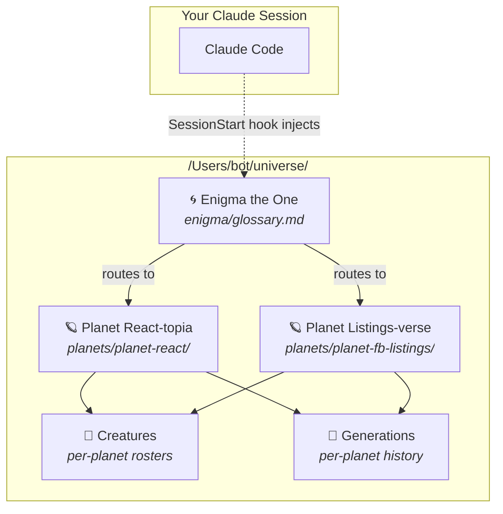
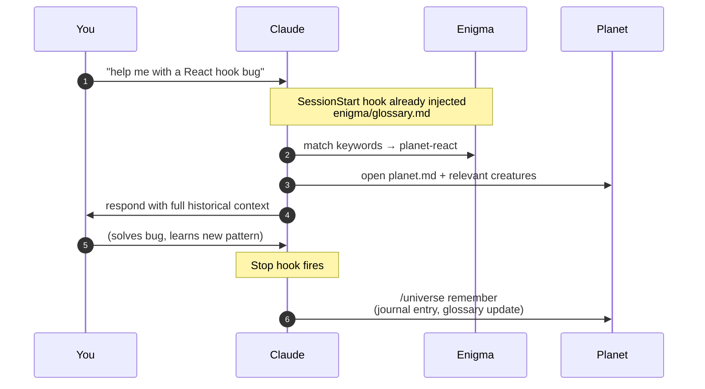
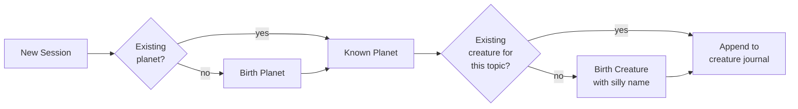

# Universe Memory System — Phase 1 Implementation Plan

> **For agentic workers:** REQUIRED SUB-SKILL: Use superpowers:subagent-driven-development (recommended) or superpowers:executing-plans to implement this plan task-by-task. Steps use checkbox (`- [ ]`) syntax for tracking.

**Goal:** Build the universe memory system's core — directory scaffold, Enigma's files, shell helpers for planet/creature/generation mutations, SessionStart and Stop hooks, the `/universe` skill, and CLAUDE.md integration. A separate Phase 2 plan will add the evaluation harness.

**Architecture:** All data lives under `/Users/bot/universe/`. Mutations happen via deterministic bash helper scripts in `.system/skill/lib/`; the `/universe` skill's SKILL.md tells Claude when and how to invoke them. Hooks in `.system/hooks/` wire the skill into every Claude Code session via `~/.claude/settings.json`. The spec this plan implements is at `/Users/bot/universe/.system/docs/specs/2026-04-13-universe-memory-system-design.md`.

**Tech Stack:** Bash (helper scripts + hooks), Markdown (all data files, skill definition, lore), JSON (`.universe-meta.json`), Mermaid (diagrams in README), plain-shell test runner (no external deps).

**Working directory for all commits:** `/Users/bot/universe/` — this IS the repo. Every task's `git add` / `git commit` is executed from there.

---

## File Structure

Created in this plan:

| Path | Responsibility |
|---|---|
| `/Users/bot/universe/README.md` | Lore, mermaid diagrams, usage overview — the human entrypoint |
| `/Users/bot/universe/.universe-meta.json` | Version, theatrical-mode flag, planet count |
| `/Users/bot/universe/.gitignore` | Ignore `.DS_Store` and test temp dirs |
| `/Users/bot/universe/enigma/glossary.md` | Lean planet index, auto-loaded every session |
| `/Users/bot/universe/enigma/chronicle.md` | Rich narrative: relationships, gen timelines, notable creatures |
| `/Users/bot/universe/planets/.gitkeep` | Placeholder so empty planets/ dir is tracked |
| `/Users/bot/universe/.system/skill/SKILL.md` | `/universe` skill definition — the instructions Claude follows |
| `/Users/bot/universe/.system/skill/lib/birth-planet.sh` | Scaffold a new planet directory + planet.md |
| `/Users/bot/universe/.system/skill/lib/birth-creature.sh` | Scaffold a new creature.md on a planet |
| `/Users/bot/universe/.system/skill/lib/start-generation.sh` | Archive current gen, open next |
| `/Users/bot/universe/.system/skill/lib/update-glossary.sh` | Update a planet's glossary row (or add one) |
| `/Users/bot/universe/.system/skill/lib/common.sh` | Shared bash helpers (UNIVERSE_ROOT resolver, frontmatter writer) |
| `/Users/bot/universe/.system/hooks/universe-load.sh` | SessionStart hook — injects glossary, detects anchor |
| `/Users/bot/universe/.system/hooks/universe-commit.sh` | Stop hook — prompts Claude to persist knowledge |
| `/Users/bot/universe/.system/tests/test_birth_planet.sh` | Tests for birth-planet.sh |
| `/Users/bot/universe/.system/tests/test_birth_creature.sh` | Tests for birth-creature.sh |
| `/Users/bot/universe/.system/tests/test_start_generation.sh` | Tests for start-generation.sh |
| `/Users/bot/universe/.system/tests/test_update_glossary.sh` | Tests for update-glossary.sh |
| `/Users/bot/universe/.system/tests/test_hooks.sh` | Tests for both hooks |
| `/Users/bot/universe/.system/tests/run-tests.sh` | Runs every `test_*.sh`, aggregates pass/fail |
| `/Users/bot/universe/.system/tests/lib/assert.sh` | Tiny assertion helpers used by every test |

Modified:

| Path | Change |
|---|---|
| `/Users/bot/CLAUDE.md` | Append "Universe Memory System" section |
| `/Users/bot/.claude/settings.json` | Register SessionStart + Stop hooks |
| `/Users/bot/.claude/skills/universe` | Symlink → `/Users/bot/universe/.system/skill/` |

---

## Task 1: Scaffold base directory + meta.json + empty Enigma files

**Files:**
- Create: `/Users/bot/universe/README.md` (stub; real content in Task 2)
- Create: `/Users/bot/universe/.universe-meta.json`
- Create: `/Users/bot/universe/.gitignore`
- Create: `/Users/bot/universe/enigma/glossary.md`
- Create: `/Users/bot/universe/enigma/chronicle.md`
- Create: `/Users/bot/universe/planets/.gitkeep`
- Create: `/Users/bot/universe/.system/skill/lib/` (directory)
- Create: `/Users/bot/universe/.system/hooks/` (directory)
- Create: `/Users/bot/universe/.system/tests/lib/` (directory)

- [ ] **Step 1: Create the directory tree**

```bash
cd /Users/bot/universe
mkdir -p enigma planets .system/skill/lib .system/hooks .system/tests/lib
touch planets/.gitkeep
```

- [ ] **Step 2: Write `.universe-meta.json`**

```bash
cat > /Users/bot/universe/.universe-meta.json <<'EOF'
{
  "version": "1.0.0",
  "theatrical_mode": false,
  "planet_count": 0,
  "created": "2026-04-13"
}
EOF
```

- [ ] **Step 3: Write `.gitignore`**

```bash
cat > /Users/bot/universe/.gitignore <<'EOF'
.DS_Store
.system/tests/tmp/
*.swp
EOF
```

- [ ] **Step 4: Write empty `enigma/glossary.md`**

```bash
cat > /Users/bot/universe/enigma/glossary.md <<'EOF'
# Enigma's Glossary

*"I am the keeper of names. Ask, and I will point the way."*
— Enigma the One

| Planet | Domain | Keywords | Last Visited | Gen | Creatures | Why Last Modified |
|---|---|---|---|---|---|---|
<!-- planets will be appended here by update-glossary.sh -->

EOF
```

- [ ] **Step 5: Write empty `enigma/chronicle.md`**

```bash
cat > /Users/bot/universe/enigma/chronicle.md <<'EOF'
# The Chronicle

*Where Enigma records the shape of the cosmos.*

## Planet Relationships

<!-- Edges between planets appear here as domains overlap. -->

## Generation Timeline

<!-- Each planet's gen history is added when a generation archives. -->

## Notable Creatures

<!-- Creatures of significance are catalogued here. -->

EOF
```

- [ ] **Step 6: Write README stub (real content in Task 2)**

```bash
cat > /Users/bot/universe/README.md <<'EOF'
# Universe

Knowledge base for Claude sessions. See `.system/docs/specs/` for design.

(README body written in Task 2.)
EOF
```

- [ ] **Step 7: Commit**

```bash
cd /Users/bot/universe && git add -A && git commit -m "scaffold universe directory tree and empty enigma files"
```

---

## Task 2: Write the beautiful README with lore and mermaid diagrams

**Files:**
- Modify: `/Users/bot/universe/README.md`

- [ ] **Step 1: Overwrite README.md with full lore**

```bash
cat > /Users/bot/universe/README.md <<'EOF'
# 🌌 Universe

> *"Every world has a name. Every name has a keeper. I am the keeper of names."*
> — **Enigma the One**, the Ancient

A persistent, cross-session, cross-project knowledge base for Claude.
Inspired by Andrej Karpathy's [personal LLM wiki](https://www.mindstudio.ai/blog/andrej-karpathy-llm-wiki-knowledge-base-claude-code).
Designed to compound wisdom the way a real wiki does — but told as a story, because stories stick.

---

## The Lore

In the silent expanse beyond your cursor, there is a universe.

At its center drifts **Enigma the One** — an ancient alien of unknowable age,
keeper of the glossary of worlds. He does not speak unless spoken to, but he
always knows which planet holds the answer you seek.

Around him turn **planets** — each one a domain of knowledge (React, SQL,
DevOps, whatever work you do). Every planet has its own biology: creatures
that live there, food they eat, unique abilities they wield.

**Creatures** are born on planets when Claude first encounters a new
sub-expertise. They carry silly, video-game-esque names — *Jimbo the
React-tor*, *Sally the SQLite*, *Grom the CSS-wielder* — and each keeps a
journal of every session they witness.

**Generations** are eras on a planet. When something paradigm-shifting
happens — a framework migration, a major refactor — the current era is
sealed, compressed into a summary scroll, and the next era begins.

---

## Architecture



## A Day in the Universe



## Birth of a Creature



---

## Layout

```
/Users/bot/universe/
├── README.md                  ← you are here
├── .universe-meta.json        ← version, config
├── enigma/
│   ├── glossary.md            ← lean index; auto-loaded every session
│   └── chronicle.md           ← rich narrative; opened on demand
├── planets/                   ← one directory per domain
│   └── planet-<name>/
│       ├── planet.md          ← identity card (lore + keywords)
│       ├── creatures/         ← silly-named sub-experts
│       └── generations/       ← eras (active + archived summaries)
└── .system/                   ← tooling (skill, hooks, tests, docs)
    ├── skill/                 ← /universe skill Claude uses
    ├── hooks/                 ← SessionStart + Stop
    ├── tests/                 ← shell tests for the helper scripts
    └── docs/
        ├── specs/             ← design specs
        └── plans/             ← implementation plans
```

---

## Using It

You don't. Claude does — automatically.

- **SessionStart hook** injects Enigma's glossary into every Claude session.
- The **`/universe` skill** tells Claude when to `recall`, `remember`,
  `birth-planet`, `birth-creature`, or `start-generation`.
- **Stop hook** prompts Claude to persist anything worth keeping.

Your only job is to work as normal. The universe grows around you.

### Optional: theatrical mode

```
/universe enigma speak
```

Flips a flag that makes Enigma respond in-character: *"Ancient one, the
seeker asks of React. Planet Verdant-Hook holds the answer; Jimbo the
React-tor tends its eastern shore."* Toggle off with `enigma quiet`.

---

## Why not just `memory.md`?

Flat memory files degrade as they grow. The universe stays performant
because it:

- **Routes**: Enigma's lean glossary (<300 tokens at 30 planets) picks the
  right planet without loading the rest.
- **Isolates**: each creature is its own file — greppable, focused,
  git-blamable.
- **Forgets gracefully**: old generations get compressed into summaries;
  raw logs stay on disk but aren't read.

Empirical proof lives in the eval harness at `.system/eval/` (Phase 2).

---

*May the Ancient One guide your seeking.*
EOF
```

- [ ] **Step 2: Commit**

```bash
cd /Users/bot/universe && git add README.md && git commit -m "write README with lore, mermaid diagrams, and usage"
```

---

## Task 3: Shared bash helpers (`common.sh`)

**Files:**
- Create: `/Users/bot/universe/.system/skill/lib/common.sh`
- Create: `/Users/bot/universe/.system/tests/lib/assert.sh`

- [ ] **Step 1: Write `common.sh`**

```bash
cat > /Users/bot/universe/.system/skill/lib/common.sh <<'EOF'
#!/usr/bin/env bash
# Shared helpers for universe skill scripts.
# Source this from every script: `source "$(dirname "$0")/common.sh"`

set -euo pipefail

# Resolve UNIVERSE_ROOT. Honors env override for tests.
resolve_universe_root() {
  if [[ -n "${UNIVERSE_ROOT:-}" ]]; then
    echo "$UNIVERSE_ROOT"
  else
    echo "/Users/bot/universe"
  fi
}

UNIVERSE_ROOT="$(resolve_universe_root)"

# today_iso — returns YYYY-MM-DD
today_iso() {
  date +%Y-%m-%d
}

# slugify <string> — lowercase, spaces → hyphens, strip non-[a-z0-9-]
slugify() {
  echo "$1" | tr '[:upper:]' '[:lower:]' | sed -E 's/[^a-z0-9]+/-/g; s/^-|-$//g'
}

# die <msg> — exit 1 with message
die() {
  echo "universe: $1" >&2
  exit 1
}

# planet_dir <planet-name> — echoes absolute path
planet_dir() {
  echo "$UNIVERSE_ROOT/planets/$1"
}

# require_planet_exists <planet-name>
require_planet_exists() {
  local p
  p="$(planet_dir "$1")"
  [[ -d "$p" ]] || die "planet '$1' does not exist at $p"
}
EOF
chmod +x /Users/bot/universe/.system/skill/lib/common.sh
```

- [ ] **Step 2: Write `assert.sh` (test helpers)**

```bash
cat > /Users/bot/universe/.system/tests/lib/assert.sh <<'EOF'
#!/usr/bin/env bash
# Tiny assertion helpers. Each function exits 1 on failure.

assert_eq() {
  local actual="$1"; local expected="$2"; local msg="${3:-}"
  if [[ "$actual" != "$expected" ]]; then
    echo "FAIL: ${msg:-assert_eq}"
    echo "  expected: $expected"
    echo "  actual:   $actual"
    exit 1
  fi
}

assert_file_exists() {
  [[ -f "$1" ]] || { echo "FAIL: expected file $1"; exit 1; }
}

assert_dir_exists() {
  [[ -d "$1" ]] || { echo "FAIL: expected dir $1"; exit 1; }
}

assert_contains() {
  local haystack="$1"; local needle="$2"; local msg="${3:-}"
  if [[ "$haystack" != *"$needle"* ]]; then
    echo "FAIL: ${msg:-assert_contains}"
    echo "  needle:   $needle"
    echo "  haystack: $haystack"
    exit 1
  fi
}

assert_file_contains() {
  local file="$1"; local needle="$2"
  grep -Fq -- "$needle" "$file" || {
    echo "FAIL: file $file missing: $needle"; exit 1;
  }
}

pass() {
  echo "  ✓ $1"
}

# Make a temp universe for a test, echo its path.
make_test_universe() {
  local tmp
  tmp="$(mktemp -d)"
  mkdir -p "$tmp/enigma" "$tmp/planets"
  cat > "$tmp/enigma/glossary.md" <<GLOSS
# Enigma's Glossary

| Planet | Domain | Keywords | Last Visited | Gen | Creatures | Why Last Modified |
|---|---|---|---|---|---|---|
GLOSS
  cat > "$tmp/.universe-meta.json" <<META
{"version":"1.0.0","theatrical_mode":false,"planet_count":0,"created":"2026-04-13"}
META
  echo "$tmp"
}
EOF
chmod +x /Users/bot/universe/.system/tests/lib/assert.sh
```

- [ ] **Step 3: Commit**

```bash
cd /Users/bot/universe && git add .system/skill/lib/common.sh .system/tests/lib/assert.sh && git commit -m "add common.sh and assert.sh helpers"
```

---

## Task 4: `birth-planet.sh` — scaffold a new planet (TDD)

**Files:**
- Create: `/Users/bot/universe/.system/tests/test_birth_planet.sh`
- Create: `/Users/bot/universe/.system/skill/lib/birth-planet.sh`

- [ ] **Step 1: Write the failing test**

```bash
cat > /Users/bot/universe/.system/tests/test_birth_planet.sh <<'EOF'
#!/usr/bin/env bash
set -euo pipefail
DIR="$(cd "$(dirname "$0")" && pwd)"
source "$DIR/lib/assert.sh"

SCRIPT="$DIR/../skill/lib/birth-planet.sh"

echo "test_birth_planet"

# Test 1: creates planet directory with planet.md
UNIVERSE_ROOT="$(make_test_universe)"
export UNIVERSE_ROOT
"$SCRIPT" "react" "React & frontend patterns" "react,hooks,jsx" "Verdant-Hook" "A world of dense canopies" "re-renders" "reconciliation-at-speed"
assert_dir_exists "$UNIVERSE_ROOT/planets/planet-react"
assert_file_exists "$UNIVERSE_ROOT/planets/planet-react/planet.md"
assert_dir_exists "$UNIVERSE_ROOT/planets/planet-react/creatures"
assert_dir_exists "$UNIVERSE_ROOT/planets/planet-react/generations"
pass "creates planet dir and skeleton"

# Test 2: planet.md has correct frontmatter
assert_file_contains "$UNIVERSE_ROOT/planets/planet-react/planet.md" "name: planet-react"
assert_file_contains "$UNIVERSE_ROOT/planets/planet-react/planet.md" "domain: React & frontend patterns"
assert_file_contains "$UNIVERSE_ROOT/planets/planet-react/planet.md" "keywords: [react, hooks, jsx]"
assert_file_contains "$UNIVERSE_ROOT/planets/planet-react/planet.md" "generation: gen-0"
assert_file_contains "$UNIVERSE_ROOT/planets/planet-react/planet.md" "# Planet Verdant-Hook"
assert_file_contains "$UNIVERSE_ROOT/planets/planet-react/planet.md" "re-renders"
assert_file_contains "$UNIVERSE_ROOT/planets/planet-react/planet.md" "reconciliation-at-speed"
pass "planet.md has correct frontmatter and lore"

# Test 3: opens gen-0.md automatically
assert_file_exists "$UNIVERSE_ROOT/planets/planet-react/generations/gen-0.md"
assert_file_contains "$UNIVERSE_ROOT/planets/planet-react/generations/gen-0.md" "generation: gen-0"
assert_file_contains "$UNIVERSE_ROOT/planets/planet-react/generations/gen-0.md" "status: active"
pass "opens gen-0"

# Test 4: refuses to overwrite an existing planet
set +e
"$SCRIPT" "react" "dup" "x" "Y" "z" "q" "r" 2>/dev/null
RC=$?
set -e
assert_eq "$RC" "1" "should refuse duplicate"
pass "refuses duplicate planet"

rm -rf "$UNIVERSE_ROOT"
echo "PASS: test_birth_planet"
EOF
chmod +x /Users/bot/universe/.system/tests/test_birth_planet.sh
```

- [ ] **Step 2: Run test to verify it fails**

```bash
/Users/bot/universe/.system/tests/test_birth_planet.sh
```

Expected: FAIL (script doesn't exist or is not executable).

- [ ] **Step 3: Write `birth-planet.sh`**

```bash
cat > /Users/bot/universe/.system/skill/lib/birth-planet.sh <<'EOF'
#!/usr/bin/env bash
# Usage: birth-planet.sh <slug> <domain> <keywords-csv> <lore-name> <lore-tagline> <food-metaphor> <ability-list-csv>
# Example: birth-planet.sh react "React & frontend patterns" "react,hooks,jsx" "Verdant-Hook" "dense canopies" "re-renders" "reconciliation,prop-sight"

set -euo pipefail
SCRIPT_DIR="$(cd "$(dirname "$0")" && pwd)"
source "$SCRIPT_DIR/common.sh"

[[ $# -eq 7 ]] || die "usage: birth-planet.sh <slug> <domain> <keywords-csv> <lore-name> <lore-tagline> <food-metaphor> <ability-list-csv>"

SLUG="$(slugify "$1")"
DOMAIN="$2"
KEYWORDS_CSV="$3"
LORE_NAME="$4"
LORE_TAGLINE="$5"
FOOD="$6"
ABILITIES_CSV="$7"

PLANET_NAME="planet-$SLUG"
PLANET_PATH="$UNIVERSE_ROOT/planets/$PLANET_NAME"

[[ ! -e "$PLANET_PATH" ]] || die "planet '$PLANET_NAME' already exists at $PLANET_PATH"

mkdir -p "$PLANET_PATH/creatures" "$PLANET_PATH/generations"

# Format keywords list: "a,b,c" -> "[a, b, c]"
KEYWORDS_FMT="[$(echo "$KEYWORDS_CSV" | sed 's/,/, /g')]"

# Format abilities as markdown bullets
ABILITIES_MD=""
IFS=',' read -ra ABIL <<< "$ABILITIES_CSV"
for a in "${ABIL[@]}"; do
  ABILITIES_MD+="- ${a# }"$'\n'
done

TODAY="$(today_iso)"

cat > "$PLANET_PATH/planet.md" <<PLANET
---
name: $PLANET_NAME
born: $TODAY
domain: $DOMAIN
keywords: $KEYWORDS_FMT
generation: gen-0
anchor_paths: []
---

# Planet $LORE_NAME
*$LORE_TAGLINE*

## Food
The creatures here feed on **$FOOD**.
Birth cycle: new creatures spawn when a distinct sub-expertise first appears.

## Unique Abilities
$ABILITIES_MD

## Creatures
Dynamically populated — see \`creatures/\` directory.
PLANET

cat > "$PLANET_PATH/generations/gen-0.md" <<GEN
---
generation: gen-0
started: $TODAY
trigger: "planet birth"
status: active
---

# Generation 0 — The First Era
*Seeded at the birth of $PLANET_NAME.*

## New Creatures

## Key Additions
GEN

echo "$PLANET_PATH"
EOF
chmod +x /Users/bot/universe/.system/skill/lib/birth-planet.sh
```

- [ ] **Step 4: Run test to verify it passes**

```bash
/Users/bot/universe/.system/tests/test_birth_planet.sh
```

Expected: `PASS: test_birth_planet`.

- [ ] **Step 5: Commit**

```bash
cd /Users/bot/universe && git add .system/skill/lib/birth-planet.sh .system/tests/test_birth_planet.sh && git commit -m "birth-planet.sh scaffolds planet dir with lore and gen-0"
```

---

## Task 5: `birth-creature.sh` — spawn a creature on a planet (TDD)

**Files:**
- Create: `/Users/bot/universe/.system/tests/test_birth_creature.sh`
- Create: `/Users/bot/universe/.system/skill/lib/birth-creature.sh`

- [ ] **Step 1: Write the failing test**

```bash
cat > /Users/bot/universe/.system/tests/test_birth_creature.sh <<'EOF'
#!/usr/bin/env bash
set -euo pipefail
DIR="$(cd "$(dirname "$0")" && pwd)"
source "$DIR/lib/assert.sh"

BIRTH_PLANET="$DIR/../skill/lib/birth-planet.sh"
BIRTH_CREATURE="$DIR/../skill/lib/birth-creature.sh"

echo "test_birth_creature"

UNIVERSE_ROOT="$(make_test_universe)"
export UNIVERSE_ROOT

"$BIRTH_PLANET" "react" "React patterns" "react,hooks" "Verdant-Hook" "canopies" "re-renders" "reconciliation"

# Test 1: creates creature file with frontmatter
"$BIRTH_CREATURE" "react" "jimbo-the-reactor" "Jimbo the React-tor" "hooks, state management" "A wiry creature with eight fingers, each a useState."
C="$UNIVERSE_ROOT/planets/planet-react/creatures/jimbo-the-reactor.md"
assert_file_exists "$C"
assert_file_contains "$C" "name: jimbo-the-reactor"
assert_file_contains "$C" "planet: planet-react"
assert_file_contains "$C" "born_in_generation: gen-0"
assert_file_contains "$C" "expertise: hooks, state management"
assert_file_contains "$C" "sessions: 0"
assert_file_contains "$C" "# Jimbo the React-tor"
assert_file_contains "$C" "eight fingers"
assert_file_contains "$C" "## Distilled Wisdom"
assert_file_contains "$C" "## Journal"
pass "creates creature.md with correct frontmatter"

# Test 2: refuses duplicate
set +e
"$BIRTH_CREATURE" "react" "jimbo-the-reactor" "dup" "dup" "dup" 2>/dev/null
RC=$?
set -e
assert_eq "$RC" "1" "should refuse dup"
pass "refuses duplicate creature"

# Test 3: refuses nonexistent planet
set +e
"$BIRTH_CREATURE" "nonexistent" "x" "x" "x" "x" 2>/dev/null
RC=$?
set -e
assert_eq "$RC" "1"
pass "refuses unknown planet"

rm -rf "$UNIVERSE_ROOT"
echo "PASS: test_birth_creature"
EOF
chmod +x /Users/bot/universe/.system/tests/test_birth_creature.sh
```

- [ ] **Step 2: Run test to verify it fails**

```bash
/Users/bot/universe/.system/tests/test_birth_creature.sh
```

Expected: FAIL.

- [ ] **Step 3: Write `birth-creature.sh`**

```bash
cat > /Users/bot/universe/.system/skill/lib/birth-creature.sh <<'EOF'
#!/usr/bin/env bash
# Usage: birth-creature.sh <planet-slug> <creature-slug> <lore-name> <expertise> <lore-tagline>
set -euo pipefail
SCRIPT_DIR="$(cd "$(dirname "$0")" && pwd)"
source "$SCRIPT_DIR/common.sh"

[[ $# -eq 5 ]] || die "usage: birth-creature.sh <planet-slug> <creature-slug> <lore-name> <expertise> <lore-tagline>"

PLANET_SLUG="$(slugify "$1")"
CREATURE_SLUG="$(slugify "$2")"
LORE_NAME="$3"
EXPERTISE="$4"
TAGLINE="$5"

PLANET_NAME="planet-$PLANET_SLUG"
require_planet_exists "$PLANET_NAME"

CREATURE_PATH="$UNIVERSE_ROOT/planets/$PLANET_NAME/creatures/$CREATURE_SLUG.md"
[[ ! -e "$CREATURE_PATH" ]] || die "creature '$CREATURE_SLUG' already exists on $PLANET_NAME"

# Read current generation from planet.md frontmatter
GEN="$(grep -E '^generation:' "$UNIVERSE_ROOT/planets/$PLANET_NAME/planet.md" | awk '{print $2}')"
TODAY="$(today_iso)"

cat > "$CREATURE_PATH" <<CREATURE
---
name: $CREATURE_SLUG
planet: $PLANET_NAME
born: $TODAY
born_in_generation: $GEN
expertise: $EXPERTISE
sessions: 0
last_seen: $TODAY
---

# $LORE_NAME
*$TAGLINE*

## Distilled Wisdom
<!-- Short, high-signal summary rewritten on each session. -->

## Journal
<!-- Append-only session log. -->
CREATURE

echo "$CREATURE_PATH"
EOF
chmod +x /Users/bot/universe/.system/skill/lib/birth-creature.sh
```

- [ ] **Step 4: Run test to verify it passes**

```bash
/Users/bot/universe/.system/tests/test_birth_creature.sh
```

Expected: `PASS: test_birth_creature`.

- [ ] **Step 5: Commit**

```bash
cd /Users/bot/universe && git add .system/skill/lib/birth-creature.sh .system/tests/test_birth_creature.sh && git commit -m "birth-creature.sh spawns creature.md with lore and frontmatter"
```

---

## Task 6: `start-generation.sh` — archive current gen, open next (TDD)

**Files:**
- Create: `/Users/bot/universe/.system/tests/test_start_generation.sh`
- Create: `/Users/bot/universe/.system/skill/lib/start-generation.sh`

- [ ] **Step 1: Write the failing test**

```bash
cat > /Users/bot/universe/.system/tests/test_start_generation.sh <<'EOF'
#!/usr/bin/env bash
set -euo pipefail
DIR="$(cd "$(dirname "$0")" && pwd)"
source "$DIR/lib/assert.sh"

BIRTH_PLANET="$DIR/../skill/lib/birth-planet.sh"
START_GEN="$DIR/../skill/lib/start-generation.sh"

echo "test_start_generation"

UNIVERSE_ROOT="$(make_test_universe)"
export UNIVERSE_ROOT

"$BIRTH_PLANET" "react" "React patterns" "react,hooks" "Verdant-Hook" "canopies" "re-renders" "reconciliation"

# add a key addition to gen-0 so there's something to summarize
echo "- Moved to App Router" >> "$UNIVERSE_ROOT/planets/planet-react/generations/gen-0.md"

# Trigger gen-1 with a summary body
"$START_GEN" "react" "App Router migration" "Migrated from Pages Router to App Router"

# Test 1: gen-0 marked archived
assert_file_contains "$UNIVERSE_ROOT/planets/planet-react/generations/gen-0.md" "status: archived"
pass "gen-0 archived"

# Test 2: gen-0-summary.md created
assert_file_exists "$UNIVERSE_ROOT/planets/planet-react/generations/gen-0-summary.md"
assert_file_contains "$UNIVERSE_ROOT/planets/planet-react/generations/gen-0-summary.md" "Migrated from Pages Router"
pass "gen-0 summary written"

# Test 3: gen-1.md created, active
assert_file_exists "$UNIVERSE_ROOT/planets/planet-react/generations/gen-1.md"
assert_file_contains "$UNIVERSE_ROOT/planets/planet-react/generations/gen-1.md" "generation: gen-1"
assert_file_contains "$UNIVERSE_ROOT/planets/planet-react/generations/gen-1.md" "status: active"
assert_file_contains "$UNIVERSE_ROOT/planets/planet-react/generations/gen-1.md" "App Router migration"
pass "gen-1 opened active"

# Test 4: planet.md frontmatter updated
assert_file_contains "$UNIVERSE_ROOT/planets/planet-react/planet.md" "generation: gen-1"
pass "planet.md points to gen-1"

rm -rf "$UNIVERSE_ROOT"
echo "PASS: test_start_generation"
EOF
chmod +x /Users/bot/universe/.system/tests/test_start_generation.sh
```

- [ ] **Step 2: Run test to verify it fails**

```bash
/Users/bot/universe/.system/tests/test_start_generation.sh
```

Expected: FAIL.

- [ ] **Step 3: Write `start-generation.sh`**

```bash
cat > /Users/bot/universe/.system/skill/lib/start-generation.sh <<'EOF'
#!/usr/bin/env bash
# Usage: start-generation.sh <planet-slug> <trigger> <summary-body>
# Archives the active generation, writes gen-N-summary.md, and opens gen-(N+1).md.
set -euo pipefail
SCRIPT_DIR="$(cd "$(dirname "$0")" && pwd)"
source "$SCRIPT_DIR/common.sh"

[[ $# -eq 3 ]] || die "usage: start-generation.sh <planet-slug> <trigger> <summary-body>"

PLANET_SLUG="$(slugify "$1")"
TRIGGER="$2"
SUMMARY="$3"

PLANET_NAME="planet-$PLANET_SLUG"
require_planet_exists "$PLANET_NAME"

PLANET_MD="$UNIVERSE_ROOT/planets/$PLANET_NAME/planet.md"
GEN_DIR="$UNIVERSE_ROOT/planets/$PLANET_NAME/generations"

CURRENT="$(grep -E '^generation:' "$PLANET_MD" | awk '{print $2}')"
CURRENT_N="${CURRENT#gen-}"
NEXT_N="$((CURRENT_N + 1))"
NEXT="gen-$NEXT_N"
TODAY="$(today_iso)"

CURRENT_FILE="$GEN_DIR/$CURRENT.md"
[[ -f "$CURRENT_FILE" ]] || die "active gen file missing: $CURRENT_FILE"

# Flip status in current gen file
# macOS sed: use -i '' for in-place
sed -i '' 's/^status: active$/status: archived/' "$CURRENT_FILE"

# Write summary
cat > "$GEN_DIR/$CURRENT-summary.md" <<SUM
---
generation: $CURRENT
summarized_at: $TODAY
trigger: "$TRIGGER"
---

# $CURRENT — Summary

$SUMMARY
SUM

# Open next gen
cat > "$GEN_DIR/$NEXT.md" <<NEXTF
---
generation: $NEXT
started: $TODAY
trigger: "$TRIGGER"
status: active
---

# Generation $NEXT_N — $TRIGGER

## New Creatures

## Key Additions
NEXTF

# Point planet.md at the new gen
sed -i '' "s/^generation: $CURRENT$/generation: $NEXT/" "$PLANET_MD"

echo "$NEXT"
EOF
chmod +x /Users/bot/universe/.system/skill/lib/start-generation.sh
```

- [ ] **Step 4: Run test to verify it passes**

```bash
/Users/bot/universe/.system/tests/test_start_generation.sh
```

Expected: `PASS: test_start_generation`.

- [ ] **Step 5: Commit**

```bash
cd /Users/bot/universe && git add .system/skill/lib/start-generation.sh .system/tests/test_start_generation.sh && git commit -m "start-generation.sh archives active gen and opens next"
```

---

## Task 7: `update-glossary.sh` — insert or update a planet's glossary row (TDD)

**Files:**
- Create: `/Users/bot/universe/.system/tests/test_update_glossary.sh`
- Create: `/Users/bot/universe/.system/skill/lib/update-glossary.sh`

- [ ] **Step 1: Write the failing test**

```bash
cat > /Users/bot/universe/.system/tests/test_update_glossary.sh <<'EOF'
#!/usr/bin/env bash
set -euo pipefail
DIR="$(cd "$(dirname "$0")" && pwd)"
source "$DIR/lib/assert.sh"

BIRTH_PLANET="$DIR/../skill/lib/birth-planet.sh"
UPDATE_GLOSS="$DIR/../skill/lib/update-glossary.sh"

echo "test_update_glossary"

UNIVERSE_ROOT="$(make_test_universe)"
export UNIVERSE_ROOT

"$BIRTH_PLANET" "react" "React patterns" "react,hooks" "Verdant-Hook" "x" "y" "z"

# Test 1: insert new row
"$UPDATE_GLOSS" "react" "App Router migration"
assert_file_contains "$UNIVERSE_ROOT/enigma/glossary.md" "planet-react"
assert_file_contains "$UNIVERSE_ROOT/enigma/glossary.md" "App Router migration"
pass "inserts row on first call"

# Row count = 1
ROWS=$(grep -c "^| planet-" "$UNIVERSE_ROOT/enigma/glossary.md")
assert_eq "$ROWS" "1" "should have one row"
pass "exactly one row"

# Test 2: update existing row (no duplicate)
"$UPDATE_GLOSS" "react" "Added RSC patterns"
ROWS=$(grep -c "^| planet-" "$UNIVERSE_ROOT/enigma/glossary.md")
assert_eq "$ROWS" "1" "still one row after update"
assert_file_contains "$UNIVERSE_ROOT/enigma/glossary.md" "Added RSC patterns"
# old reason should be gone
if grep -q "App Router migration" "$UNIVERSE_ROOT/enigma/glossary.md"; then
  echo "FAIL: old 'why' should have been replaced"; exit 1
fi
pass "updates without duplicating"

# Test 3: refuses nonexistent planet
set +e
"$UPDATE_GLOSS" "nope" "reason" 2>/dev/null
RC=$?
set -e
assert_eq "$RC" "1"
pass "refuses unknown planet"

rm -rf "$UNIVERSE_ROOT"
echo "PASS: test_update_glossary"
EOF
chmod +x /Users/bot/universe/.system/tests/test_update_glossary.sh
```

- [ ] **Step 2: Run test to verify it fails**

```bash
/Users/bot/universe/.system/tests/test_update_glossary.sh
```

Expected: FAIL.

- [ ] **Step 3: Write `update-glossary.sh`**

```bash
cat > /Users/bot/universe/.system/skill/lib/update-glossary.sh <<'EOF'
#!/usr/bin/env bash
# Usage: update-glossary.sh <planet-slug> <why-last-modified>
# Inserts a row for this planet into enigma/glossary.md, or updates the existing row.
set -euo pipefail
SCRIPT_DIR="$(cd "$(dirname "$0")" && pwd)"
source "$SCRIPT_DIR/common.sh"

[[ $# -eq 2 ]] || die "usage: update-glossary.sh <planet-slug> <why-last-modified>"

PLANET_SLUG="$(slugify "$1")"
WHY="$2"
PLANET_NAME="planet-$PLANET_SLUG"
require_planet_exists "$PLANET_NAME"

PLANET_MD="$UNIVERSE_ROOT/planets/$PLANET_NAME/planet.md"
GLOSS="$UNIVERSE_ROOT/enigma/glossary.md"
TODAY="$(today_iso)"

# Extract fields from planet.md
DOMAIN="$(awk -F': ' '/^domain:/ {sub(/^domain: /,""); print; exit}' "$PLANET_MD")"
GEN="$(awk '/^generation:/ {print $2; exit}' "$PLANET_MD")"
KEYWORDS="$(awk -F': ' '/^keywords:/ {sub(/^keywords: /,""); print; exit}' "$PLANET_MD")"
KEYWORDS="${KEYWORDS#[}"; KEYWORDS="${KEYWORDS%]}"
CREATURE_COUNT="$(ls -1 "$UNIVERSE_ROOT/planets/$PLANET_NAME/creatures" 2>/dev/null | wc -l | tr -d ' ')"

ROW="| $PLANET_NAME | $DOMAIN | $KEYWORDS | $TODAY | $GEN | $CREATURE_COUNT | $WHY |"

# Remove any existing row for this planet
TMP="$(mktemp)"
grep -v "^| $PLANET_NAME |" "$GLOSS" > "$TMP"
mv "$TMP" "$GLOSS"

# Append the fresh row (before the trailing blank line, if any)
# Simple approach: just append at end.
echo "$ROW" >> "$GLOSS"
EOF
chmod +x /Users/bot/universe/.system/skill/lib/update-glossary.sh
```

- [ ] **Step 4: Run test to verify it passes**

```bash
/Users/bot/universe/.system/tests/test_update_glossary.sh
```

Expected: `PASS: test_update_glossary`.

- [ ] **Step 5: Commit**

```bash
cd /Users/bot/universe && git add .system/skill/lib/update-glossary.sh .system/tests/test_update_glossary.sh && git commit -m "update-glossary.sh inserts/replaces planet row in Enigma's index"
```

---

## Task 8: SessionStart hook — `universe-load.sh` (TDD)

**Files:**
- Create: `/Users/bot/universe/.system/tests/test_hooks.sh`
- Create: `/Users/bot/universe/.system/hooks/universe-load.sh`

- [ ] **Step 1: Write the failing test (hook file)**

```bash
cat > /Users/bot/universe/.system/tests/test_hooks.sh <<'EOF'
#!/usr/bin/env bash
set -euo pipefail
DIR="$(cd "$(dirname "$0")" && pwd)"
source "$DIR/lib/assert.sh"

LOAD="$DIR/../hooks/universe-load.sh"
COMMIT="$DIR/../hooks/universe-commit.sh"
BIRTH_PLANET="$DIR/../skill/lib/birth-planet.sh"

echo "test_hooks"

UNIVERSE_ROOT="$(make_test_universe)"
export UNIVERSE_ROOT

# -------- universe-load.sh --------

# Test 1: outputs glossary content when given no cwd match
OUTPUT="$("$LOAD" 2>&1)"
assert_contains "$OUTPUT" "# Enigma's Glossary" "should include glossary header"
assert_contains "$OUTPUT" "Enigma consulted" "should include status line"
pass "load outputs glossary + status"

# Test 2: detects anchor_paths match
"$BIRTH_PLANET" "react" "React" "react" "Verdant" "x" "y" "z"
# add an anchor path matching a known test dir
TEST_ANCHOR="/tmp/universe-anchor-test"
mkdir -p "$TEST_ANCHOR"
# inject anchor_paths by rewriting planet.md
sed -i '' "s|anchor_paths: \[\]|anchor_paths: [$TEST_ANCHOR]|" "$UNIVERSE_ROOT/planets/planet-react/planet.md"

OUTPUT="$(cd "$TEST_ANCHOR" && "$LOAD" 2>&1)"
assert_contains "$OUTPUT" "Anchored to: planet-react" "should detect anchor"
assert_contains "$OUTPUT" "# Planet Verdant" "should include planet.md body"
pass "load detects anchor + injects planet.md"

rm -rf "$TEST_ANCHOR"

# -------- universe-commit.sh --------

# Test 3: commit hook prints the persistence prompt
OUTPUT="$("$COMMIT" 2>&1)"
assert_contains "$OUTPUT" "/universe remember" "should prompt remember action"
pass "commit hook prompts /universe remember"

rm -rf "$UNIVERSE_ROOT"
echo "PASS: test_hooks"
EOF
chmod +x /Users/bot/universe/.system/tests/test_hooks.sh
```

- [ ] **Step 2: Run test to verify it fails**

```bash
/Users/bot/universe/.system/tests/test_hooks.sh
```

Expected: FAIL (hooks don't exist).

- [ ] **Step 3: Write `universe-load.sh`**

```bash
cat > /Users/bot/universe/.system/hooks/universe-load.sh <<'EOF'
#!/usr/bin/env bash
# SessionStart hook. Injects Enigma's glossary and any anchored planet.md into context.
set -euo pipefail
SCRIPT_DIR="$(cd "$(dirname "$0")" && pwd)"
source "$SCRIPT_DIR/../skill/lib/common.sh"

GLOSS="$UNIVERSE_ROOT/enigma/glossary.md"
[[ -f "$GLOSS" ]] || { echo "universe: glossary missing — system not initialized."; exit 0; }

# Emit glossary
cat "$GLOSS"
echo

# Anchor detection: walk planets, check anchor_paths for $PWD match
CWD="${PWD}"
ANCHORED=""
if [[ -d "$UNIVERSE_ROOT/planets" ]]; then
  for p in "$UNIVERSE_ROOT/planets"/*/; do
    [[ -d "$p" ]] || continue
    PMD="$p/planet.md"
    [[ -f "$PMD" ]] || continue
    # Read anchor_paths line: "anchor_paths: [a, b, c]"
    LINE="$(grep -E '^anchor_paths:' "$PMD" || true)"
    [[ -n "$LINE" ]] || continue
    # Extract content between brackets
    INNER="${LINE#*[}"; INNER="${INNER%]*}"
    [[ -n "$INNER" ]] || continue
    IFS=',' read -ra PATHS <<< "$INNER"
    for raw in "${PATHS[@]}"; do
      path="$(echo "$raw" | xargs)"  # trim
      [[ -z "$path" ]] && continue
      if [[ "$CWD" == "$path"* ]]; then
        ANCHORED="$(basename "$p")"
        echo "---"
        echo "# Anchored Planet ($ANCHORED)"
        echo
        cat "$PMD"
        echo
        break 2
      fi
    done
  done
fi

PLANET_COUNT=$(ls -1d "$UNIVERSE_ROOT/planets"/*/ 2>/dev/null | wc -l | tr -d ' ')
echo "---"
echo "Enigma consulted. $PLANET_COUNT planets known. Anchored to: ${ANCHORED:-none}."
EOF
chmod +x /Users/bot/universe/.system/hooks/universe-load.sh
```

- [ ] **Step 4: Write `universe-commit.sh`**

```bash
cat > /Users/bot/universe/.system/hooks/universe-commit.sh <<'EOF'
#!/usr/bin/env bash
# Stop hook. Nudges Claude to persist meaningful knowledge via /universe remember.
set -euo pipefail
cat <<'MSG'
---
Universe persistence check:
If this session produced new, non-obvious knowledge worth keeping across
sessions (a decision, a pattern, a gotcha, a domain fact), call
`/universe remember` before exiting. Otherwise, no action needed.
MSG
EOF
chmod +x /Users/bot/universe/.system/hooks/universe-commit.sh
```

- [ ] **Step 5: Run tests to verify they pass**

```bash
/Users/bot/universe/.system/tests/test_hooks.sh
```

Expected: `PASS: test_hooks`.

- [ ] **Step 6: Commit**

```bash
cd /Users/bot/universe && git add .system/hooks/ .system/tests/test_hooks.sh && git commit -m "add SessionStart and Stop hooks with tests"
```

---

## Task 9: Test runner + full regression pass

**Files:**
- Create: `/Users/bot/universe/.system/tests/run-tests.sh`

- [ ] **Step 1: Write the runner**

```bash
cat > /Users/bot/universe/.system/tests/run-tests.sh <<'EOF'
#!/usr/bin/env bash
# Run every test_*.sh in this directory. Fail fast on first failing test.
set -euo pipefail
DIR="$(cd "$(dirname "$0")" && pwd)"

FAILED=0
for t in "$DIR"/test_*.sh; do
  echo "▶ running $(basename "$t")"
  if "$t"; then
    echo "  OK"
  else
    echo "  FAILED"
    FAILED=1
  fi
  echo
done

if [[ "$FAILED" -eq 1 ]]; then
  echo "✗ at least one test failed"
  exit 1
fi
echo "✓ all tests passed"
EOF
chmod +x /Users/bot/universe/.system/tests/run-tests.sh
```

- [ ] **Step 2: Run full test suite**

```bash
/Users/bot/universe/.system/tests/run-tests.sh
```

Expected: `✓ all tests passed`.

- [ ] **Step 3: Commit**

```bash
cd /Users/bot/universe && git add .system/tests/run-tests.sh && git commit -m "add aggregate test runner"
```

---

## Task 10: `/universe` skill — `SKILL.md`

**Files:**
- Create: `/Users/bot/universe/.system/skill/SKILL.md`

- [ ] **Step 1: Write SKILL.md**

```bash
cat > /Users/bot/universe/.system/skill/SKILL.md <<'EOF'
---
name: universe
description: Persistent cross-session, cross-project memory. Consults Enigma's glossary to route a question to the right planet, then reads/writes creatures and generations. Use for `recall` when the user references past work, and `remember` at session end if new knowledge emerged. Prefer this over writing to any flat memory file.
---

# /universe skill

You have a persistent knowledge base at `/Users/bot/universe/`. It is organized as:

- **Enigma's glossary** (`enigma/glossary.md`) — a small index of every planet.
- **Planets** (`planets/planet-<name>/`) — one per domain of knowledge.
  - `planet.md` — the planet's identity card.
  - `creatures/<slug>.md` — named sub-experts who keep journals of sessions.
  - `generations/gen-<n>.md` — eras; active + archived summaries.
- **Meta** (`.universe-meta.json`) — version, theatrical-mode flag.

The SessionStart hook has already injected `enigma/glossary.md` at the top of this session.

## Actions

### `recall <query>`
When the user references past work or asks what you know about X:
1. Scan the glossary (already in context) for keyword matches.
2. Read `planets/<matching-planet>/planet.md`.
3. Read relevant creature files under `planets/<matching-planet>/creatures/`.
4. Read the active generation file under `planets/<matching-planet>/generations/gen-<current>.md`.
5. Answer using that context. If nothing matches, say so — do NOT fabricate.

### `remember`
At session end (triggered by the Stop hook's nudge), decide if this session produced new, non-obvious knowledge. If yes:
1. Pick the best matching planet from the glossary. If none fits, call `birth-planet` first.
2. Pick the best matching creature on that planet. If none fits, call `birth-creature` first.
3. Append a journal entry to the creature file:
   ```markdown
   ### YYYY-MM-DD — session: <short title>
   - <bullet>
   - <bullet>
   ```
4. Re-write the creature's `## Distilled Wisdom` section to incorporate the new lesson (keep short, high-signal).
5. Increment `sessions:` in the creature's frontmatter and update `last_seen:`.
6. Append a bullet to the active generation's `## Key Additions` section.
7. Run `update-glossary.sh <planet-slug> "<one-line why>"` to refresh Enigma's row.

If no new knowledge emerged, do nothing.

### `birth-planet`
Run when `remember` finds no matching planet. Invent lore — a name, a one-line tagline, a food-metaphor, 2-3 unique abilities — then run:
```
/Users/bot/universe/.system/skill/lib/birth-planet.sh <slug> "<domain>" "<keywords-csv>" "<Lore Name>" "<Tagline>" "<food-metaphor>" "<ability-csv>"
```

### `birth-creature`
Run when `remember` finds no creature for the current topic. Invent a **silly, video-game-esque** name (e.g. `Jimbo the React-tor`, `Sally the SQLite`, `Grom the CSS-wielder`). Never generic. Then run:
```
/Users/bot/universe/.system/skill/lib/birth-creature.sh <planet-slug> <creature-slug> "<Lore Name>" "<expertise>" "<tagline>"
```

### `start-generation`
Run ONLY at a semantic milestone (major arch shift, paradigm change, migration). Write a ≤ 500-token summary of the closing era:
```
/Users/bot/universe/.system/skill/lib/start-generation.sh <planet-slug> "<trigger>" "<summary-body>"
```

### `enigma speak` / `enigma quiet`
Toggle `theatrical_mode` in `.universe-meta.json`. When on, narrate routing decisions in-character as Enigma:
> *"Ancient one, the seeker asks of React. Planet Verdant-Hook holds the answer; Jimbo the React-tor tends its eastern shore."*

```bash
# enable:
python3 -c "import json,pathlib; p=pathlib.Path('/Users/bot/universe/.universe-meta.json'); d=json.loads(p.read_text()); d['theatrical_mode']=True; p.write_text(json.dumps(d, indent=2))"
# disable: same but False
```

## Rules

- **Never** write memory to a flat `memory.md` file or to `~/.claude/projects/*/memory/`. The universe is the single source of truth.
- **Birth a planet** only when no existing domain fits. Err toward reusing.
- **Birth a creature** per distinct sub-expertise, not per session. One session usually *visits* an existing creature and grows its journal.
- **Start a generation** only at semantic milestones. Do not tick generations for every session.
- **Creature names must be silly**. Video-game vibes. Pun-friendly. Never `ReactHelper`.
- If you are unsure whether a session produced "new, non-obvious" knowledge, err toward **not** writing. Bloat is worse than missing one fact.
EOF
```

- [ ] **Step 2: Commit**

```bash
cd /Users/bot/universe && git add .system/skill/SKILL.md && git commit -m "add /universe SKILL.md with actions, rules, and examples"
```

---

## Task 11: Symlink skill into `~/.claude/skills/universe`

**Files:**
- Create: symlink `~/.claude/skills/universe` → `/Users/bot/universe/.system/skill`

- [ ] **Step 1: Confirm target doesn't already exist**

```bash
ls -la ~/.claude/skills/universe 2>/dev/null
```

Expected: does not exist. If it does, STOP and ask the user before overwriting.

- [ ] **Step 2: Create symlink**

```bash
ln -s /Users/bot/universe/.system/skill ~/.claude/skills/universe
ls -la ~/.claude/skills/universe
```

Expected: symlink pointing to `/Users/bot/universe/.system/skill`.

- [ ] **Step 3: Verify Claude can resolve SKILL.md via the symlink**

```bash
cat ~/.claude/skills/universe/SKILL.md | head -5
```

Expected: shows the frontmatter `name: universe`.

*(No commit — this is a local symlink, not part of the repo.)*

---

## Task 12: Register hooks in `~/.claude/settings.json`

**Files:**
- Modify: `/Users/bot/.claude/settings.json`

> ⚠️ This modifies shared user settings. The user has confirmed this is the scope. Back up first.

- [ ] **Step 1: Back up settings.json**

```bash
cp /Users/bot/.claude/settings.json /Users/bot/.claude/settings.json.bak-$(date +%Y%m%d-%H%M%S)
```

- [ ] **Step 2: Inspect current hooks section**

```bash
python3 -c "import json; d=json.load(open('/Users/bot/.claude/settings.json')); print(json.dumps(d.get('hooks', {}), indent=2))"
```

Record the output so you know what to merge with.

- [ ] **Step 3: Merge in universe hooks**

```bash
python3 <<'PY'
import json, pathlib
p = pathlib.Path('/Users/bot/.claude/settings.json')
d = json.loads(p.read_text())
hooks = d.setdefault('hooks', {})

def add_hook(event, cmd):
    entries = hooks.setdefault(event, [])
    # Avoid duplicate entries
    for e in entries:
        if isinstance(e, dict) and e.get('command') == cmd:
            return
    entries.append({'command': cmd})

add_hook('SessionStart', '/Users/bot/universe/.system/hooks/universe-load.sh')
add_hook('Stop',         '/Users/bot/universe/.system/hooks/universe-commit.sh')

p.write_text(json.dumps(d, indent=2) + '\n')
print(json.dumps(d.get('hooks'), indent=2))
PY
```

Expected: output shows both `SessionStart` and `Stop` arrays each containing the universe hook path.

- [ ] **Step 4: Verify settings file still parses**

```bash
python3 -c "import json; json.load(open('/Users/bot/.claude/settings.json')); print('OK')"
```

Expected: `OK`.

*(No commit inside `/Users/bot/universe/`; this change lives in `~/.claude/`.)*

---

## Task 13: Append Universe section to `/Users/bot/CLAUDE.md`

**Files:**
- Modify: `/Users/bot/CLAUDE.md`

- [ ] **Step 1: Back up**

```bash
cp /Users/bot/CLAUDE.md /Users/bot/CLAUDE.md.bak-$(date +%Y%m%d-%H%M%S)
```

- [ ] **Step 2: Append the Universe section**

```bash
cat >> /Users/bot/CLAUDE.md <<'EOF'

## Universe Memory System

You have access to a persistent cross-project knowledge system at `/Users/bot/universe/`.
Consult it instead of relying on any flat memory file.

**Always:**
- The SessionStart hook injects `enigma/glossary.md` at session start — read it.
- When the user references past work, invoke `/universe recall`.
- At session end, if meaningful knowledge emerged, invoke `/universe remember`.

**Rules:**
- **Birth a planet** only when no existing domain fits. Err toward reusing.
- **Birth a creature** per distinct sub-expertise. Not one per session. Names must be silly, video-game-esque (e.g. "Jimbo the React-tor").
- **Start a new generation** only at semantic milestones (major arch shift, paradigm change).
- **Never** write memories to any flat `memory.md` or to `~/.claude/projects/*/memory/`. Universe is the single source of truth.
EOF
```

- [ ] **Step 3: Verify the section appears**

```bash
grep -A 2 "## Universe Memory System" /Users/bot/CLAUDE.md
```

Expected: shows the new section header and its first lines.

*(No commit inside `/Users/bot/universe/`; this file is at a higher level.)*

---

## Task 14: End-to-end smoke test

Simulate one real user flow against the live universe (not a temp dir): birth a planet, birth a creature, append a journal entry, update glossary, verify everything readable.

**Files:**
- No new files. Exercises existing scripts against `/Users/bot/universe/`.

- [ ] **Step 1: Birth a test planet**

```bash
/Users/bot/universe/.system/skill/lib/birth-planet.sh \
  "smoke-test" \
  "Smoke test domain" \
  "smoke,test,demo" \
  "Ashveil" \
  "A hazy dominion where only the curious tread." \
  "log-lines" \
  "grep-vision,side-effect-resistance"
```

Expected: prints `/Users/bot/universe/planets/planet-smoke-test`.

- [ ] **Step 2: Birth a creature**

```bash
/Users/bot/universe/.system/skill/lib/birth-creature.sh \
  "smoke-test" \
  "testo-the-greppler" \
  "Testo the Greppler" \
  "regex, log triage" \
  "Four-eyed, five-finger-typed, allergic to false positives."
```

Expected: prints path to new creature.md.

- [ ] **Step 3: Update glossary**

```bash
/Users/bot/universe/.system/skill/lib/update-glossary.sh "smoke-test" "smoke test run"
cat /Users/bot/universe/enigma/glossary.md
```

Expected: glossary contains a row for `planet-smoke-test`.

- [ ] **Step 4: Run SessionStart hook manually from the universe dir**

```bash
cd /Users/bot/universe && ./.system/hooks/universe-load.sh | tail -5
```

Expected: last lines include `Enigma consulted. N planets known.` with N ≥ 1.

- [ ] **Step 5: Tear down the smoke-test planet so it doesn't pollute the universe**

```bash
rm -rf /Users/bot/universe/planets/planet-smoke-test
# remove its glossary row
python3 <<'PY'
import pathlib
p = pathlib.Path('/Users/bot/universe/enigma/glossary.md')
p.write_text('\n'.join(l for l in p.read_text().splitlines() if not l.startswith('| planet-smoke-test |')) + '\n')
PY
```

- [ ] **Step 6: Commit any residual state** (should be clean after cleanup)

```bash
cd /Users/bot/universe && git status
```

If anything is dirty (unexpected), investigate before committing. If clean, nothing to do.

- [ ] **Step 7: Final sanity — run the aggregate test suite once more**

```bash
/Users/bot/universe/.system/tests/run-tests.sh
```

Expected: `✓ all tests passed`.

---

## Decisions Locked In This Plan

- Helper logic lives in **bash scripts** (not embedded in SKILL.md instructions), so behavior is deterministic and unit-testable.
- Tests use **plain shell + tiny assertion helpers** — no bats, no dependencies.
- Scripts honor a `UNIVERSE_ROOT` env var so tests can run against temp dirs.
- `sed -i ''` is used for in-place edits (macOS-compatible; plan assumes macOS per the Darwin environment).
- Hooks are registered in `~/.claude/settings.json`, not a per-project hooks file, because universe is global.
- CLAUDE.md update targets `/Users/bot/CLAUDE.md` (the file already being loaded by Claude Code from the home directory).
- Phase 2 (eval harness) is **deferred** to a sibling plan: `2026-04-XX-universe-phase-2-eval.md`.
