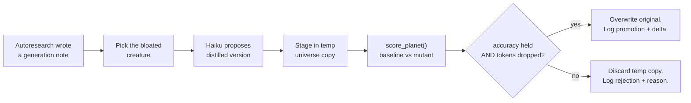

# Phase 3 — Fitness-Gated Distillation Implementation Plan

> **For agentic workers:** REQUIRED SUB-SKILL: Use superpowers:subagent-driven-development (recommended) or superpowers:executing-plans to implement this plan task-by-task. Steps use checkbox (`- [ ]`) syntax for tracking.

**Goal:** Add a fitness-gated distillation loop that proposes tighter creature files and keeps them only if `score_planet()` proves accuracy held while tokens dropped.

**Architecture:** Extend the existing 6h evolution_tick. After autoresearch completes, run a mutation tick: pick a bloated creature, propose a distilled version via Haiku, score the staged universe, promote the edit only if the gate passes. Original files are never touched until the score proves the mutation is safe.

**Tech Stack:** Python 3 stdlib (sqlite3, shutil, pathlib, tempfile, subprocess), `anthropic` SDK (already a dep), pytest (already wired).

---

## File Structure

**Create:**
- `scripts/propose_distillation.py` — Haiku proposer for creature distillation
- `scripts/mutation_tick.py` — orchestrator (find → propose → stage → score → gate → promote/reject)
- `.system/eval/tests/test_propose_distillation.py` — proposer unit test
- `.system/eval/tests/test_mutation_gate.py` — pure-function gate edge cases
- `.system/eval/tests/test_mutation_tick.py` — integration test with fixture planet
- `.system/eval/scenarios/seed_universe/planets/planet-bloated/` — fixture planet for testing (one creature with verbose journal)

**Modify:**
- `scripts/evolve.py` — add `mutation_promoted` and `mutation_rejected` event types
- `scripts/evolution_tick.py` — call mutation_tick.main() after autoresearch succeeds
- `scripts/cosmo` — add `cosmo evolve mutations` subcommand
- `.system/eval/tests/conftest.py` — add `scripts/` to sys.path so tests can import the new modules

---

## Task 1: Extend evolutions DB schema for mutation events

**Files:**
- Modify: `scripts/evolve.py`
- Test: `.system/eval/tests/test_mutation_events.py` (new)

**Why:** The existing schema has a single `status` column with CHECK constraint that rejects unknown values. Phase 3 needs to record mutation outcomes alongside autoresearch outcomes.

- [ ] **Step 1: Write the failing test**

Create `.system/eval/tests/test_mutation_events.py`:

```python
import os
import sys
import sqlite3
import tempfile
from pathlib import Path

REPO = Path(__file__).resolve().parents[3]
sys.path.insert(0, str(REPO / "scripts"))


def test_evolutions_table_accepts_mutation_statuses(tmp_path, monkeypatch):
    monkeypatch.setenv("UNIVERSE_ROOT", str(tmp_path))
    (tmp_path / "enigma").mkdir()
    import importlib
    import evolve
    importlib.reload(evolve)  # rebind _db_path() to new env

    conn = evolve._connect()
    now = evolve._now_iso(conn)
    # both new statuses must be accepted by the CHECK constraint
    for status in ("mutation_promoted", "mutation_rejected"):
        conn.execute(
            "INSERT INTO evolutions "
            "(planet_slug, status, message, started_at, updated_at, completed_at) "
            "VALUES (?, ?, ?, ?, ?, ?)",
            (f"planet-{status}", status, "test", now, now, now),
        )
    conn.commit()
    rows = conn.execute(
        "SELECT planet_slug, status FROM evolutions ORDER BY planet_slug"
    ).fetchall()
    assert {r["status"] for r in rows} >= {"mutation_promoted", "mutation_rejected"}
```

- [ ] **Step 2: Run test to verify it fails**

```bash
cd /Users/bot/universe && python3 -m pytest .system/eval/tests/test_mutation_events.py -v
```

Expected: FAIL with sqlite3 IntegrityError on the CHECK constraint.

- [ ] **Step 3: Update the schema in evolve.py**

In `scripts/evolve.py`, replace the CHECK constraint inside `_connect()`:

```python
conn.execute(
    """
    CREATE TABLE IF NOT EXISTS evolutions (
      planet_slug   TEXT PRIMARY KEY,
      status        TEXT NOT NULL CHECK (status IN
                       ('pending','running','complete','failed',
                        'mutation_promoted','mutation_rejected')),
      message       TEXT,
      started_at    TEXT,
      updated_at    TEXT NOT NULL,
      completed_at  TEXT,
      session_id    TEXT
    )
    """
)
```

The CREATE TABLE IF NOT EXISTS is a no-op on existing DBs, so add a one-time migration immediately after the CREATE:

```python
# Phase 3: extend the CHECK constraint on existing DBs by recreating the
# table. SQLite cannot ALTER TABLE a CHECK constraint, so we copy.
cur = conn.execute(
    "SELECT sql FROM sqlite_master WHERE type='table' AND name='evolutions'"
).fetchone()
if cur and "mutation_promoted" not in cur[0]:
    conn.executescript("""
        BEGIN;
        ALTER TABLE evolutions RENAME TO evolutions_v1;
        CREATE TABLE evolutions (
          planet_slug   TEXT PRIMARY KEY,
          status        TEXT NOT NULL CHECK (status IN
                           ('pending','running','complete','failed',
                            'mutation_promoted','mutation_rejected')),
          message       TEXT,
          started_at    TEXT,
          updated_at    TEXT NOT NULL,
          completed_at  TEXT,
          session_id    TEXT
        );
        INSERT INTO evolutions SELECT * FROM evolutions_v1;
        DROP TABLE evolutions_v1;
        COMMIT;
    """)
conn.commit()
```

- [ ] **Step 4: Run test to verify it passes**

```bash
cd /Users/bot/universe && python3 -m pytest .system/eval/tests/test_mutation_events.py -v
```

Expected: PASS.

- [ ] **Step 5: Commit**

```bash
cd /Users/bot/universe && git add scripts/evolve.py .system/eval/tests/test_mutation_events.py && git commit -m "feat(phase3): extend evolutions schema for mutation events

Adds mutation_promoted and mutation_rejected to the status CHECK
constraint, with an inline migration for existing DBs."
```

---

## Task 2: Add scripts/ to test sys.path

**Files:**
- Modify: `.system/eval/tests/conftest.py`

**Why:** Phase 3 modules live in `scripts/` (alongside `evolution_tick.py`, `evolve.py`). Tests need to import them.

- [ ] **Step 1: Append the scripts path to conftest**

In `.system/eval/tests/conftest.py`, after the existing `sys.path.insert`:

```python
# .system/eval/tests/conftest.py
import sys
from pathlib import Path
REPO = Path(__file__).resolve().parents[3]
sys.path.insert(0, str(REPO / ".system/eval"))
sys.path.insert(0, str(REPO / "scripts"))
```

- [ ] **Step 2: Verify existing tests still pass**

```bash
cd /Users/bot/universe && bash .system/eval/tests/run-tests.sh
```

Expected: all existing tests still PASS (sys.path additions are non-breaking).

- [ ] **Step 3: Commit**

```bash
cd /Users/bot/universe && git add .system/eval/tests/conftest.py && git commit -m "test(phase3): expose scripts/ on the test sys.path"
```

---

## Task 3: Build the gate function (pure, TDD-friendly)

**Files:**
- Create: `scripts/mutation_tick.py` (just the gate fn for now)
- Test: `.system/eval/tests/test_mutation_gate.py`

**Why:** The gate is the single most important function — it's the safety floor. Build it first, prove its edge cases, then everything else can call it.

- [ ] **Step 1: Write the failing test**

Create `.system/eval/tests/test_mutation_gate.py`:

```python
import sys
from dataclasses import dataclass
from pathlib import Path

REPO = Path(__file__).resolve().parents[3]
sys.path.insert(0, str(REPO / "scripts"))

from mutation_tick import gate, GateResult  # noqa: E402


@dataclass
class S:
    accuracy_mean: float
    input_tokens_mean: float
    n_probes: int = 5


def test_gate_passes_when_accuracy_holds_and_tokens_drop():
    base = S(accuracy_mean=0.90, input_tokens_mean=1000.0)
    mut = S(accuracy_mean=0.90, input_tokens_mean=800.0)
    r = gate(base, mut)
    assert r.passed is True
    assert "tokens" in r.reason.lower()


def test_gate_passes_when_accuracy_rises_and_tokens_drop():
    base = S(accuracy_mean=0.80, input_tokens_mean=1000.0)
    mut = S(accuracy_mean=0.95, input_tokens_mean=900.0)
    assert gate(base, mut).passed is True


def test_gate_rejects_when_accuracy_drops():
    base = S(accuracy_mean=0.90, input_tokens_mean=1000.0)
    mut = S(accuracy_mean=0.80, input_tokens_mean=500.0)  # tokens way down
    r = gate(base, mut)
    assert r.passed is False
    assert "accuracy" in r.reason.lower()


def test_gate_rejects_when_tokens_rise_even_with_accuracy_gain():
    base = S(accuracy_mean=0.80, input_tokens_mean=1000.0)
    mut = S(accuracy_mean=0.95, input_tokens_mean=1100.0)
    r = gate(base, mut)
    assert r.passed is False
    assert "token" in r.reason.lower()


def test_gate_rejects_when_tokens_equal_no_savings():
    base = S(accuracy_mean=0.90, input_tokens_mean=1000.0)
    mut = S(accuracy_mean=0.90, input_tokens_mean=1000.0)
    r = gate(base, mut)
    assert r.passed is False  # need a strict drop in tokens


def test_gate_passes_with_floating_point_slop():
    # mutant accuracy is 1e-9 lower due to float arithmetic — should still pass
    base = S(accuracy_mean=0.9, input_tokens_mean=1000.0)
    mut = S(accuracy_mean=0.9 - 1e-9, input_tokens_mean=900.0)
    assert gate(base, mut).passed is True
```

- [ ] **Step 2: Run test to verify it fails**

```bash
cd /Users/bot/universe && python3 -m pytest .system/eval/tests/test_mutation_gate.py -v
```

Expected: FAIL with `ModuleNotFoundError: No module named 'mutation_tick'`.

- [ ] **Step 3: Write minimal mutation_tick.py with gate only**

Create `scripts/mutation_tick.py`:

```python
#!/usr/bin/env python3
"""mutation_tick — fitness-gated distillation orchestrator (Phase 3).

After autoresearch completes for a planet, this picks a candidate creature,
asks Haiku for a distilled version, stages it in a temp universe copy,
runs score_planet against staged + baseline, and promotes the edit only
if the gate passes.

Original creature files are never modified until the gate passes.
"""
from __future__ import annotations
from dataclasses import dataclass


# Floating-point slop tolerance for the accuracy comparison. Aggregating
# many probe scores can yield 1e-9 drift even when the answer is identical.
ACCURACY_EPSILON = 1e-6


@dataclass
class GateResult:
    passed: bool
    reason: str
    accuracy_delta: float
    tokens_delta: float


def gate(baseline, mutant) -> GateResult:
    """Decide whether to promote a mutation.

    Pass iff: mutant accuracy >= baseline accuracy (within epsilon)
              AND mutant input_tokens_mean strictly less than baseline.

    `baseline` and `mutant` must each have `accuracy_mean` and
    `input_tokens_mean` attributes (PlanetScore-shaped).
    """
    acc_delta = mutant.accuracy_mean - baseline.accuracy_mean
    tok_delta = mutant.input_tokens_mean - baseline.input_tokens_mean

    if acc_delta < -ACCURACY_EPSILON:
        return GateResult(
            passed=False,
            reason=f"accuracy dropped: {baseline.accuracy_mean:.3f} -> "
                   f"{mutant.accuracy_mean:.3f}",
            accuracy_delta=acc_delta,
            tokens_delta=tok_delta,
        )
    if tok_delta >= 0:
        return GateResult(
            passed=False,
            reason=f"no token savings: {baseline.input_tokens_mean:.0f} -> "
                   f"{mutant.input_tokens_mean:.0f}",
            accuracy_delta=acc_delta,
            tokens_delta=tok_delta,
        )
    return GateResult(
        passed=True,
        reason=f"accuracy held ({mutant.accuracy_mean:.3f}), "
               f"tokens {baseline.input_tokens_mean:.0f} -> "
               f"{mutant.input_tokens_mean:.0f} ({tok_delta:.0f})",
        accuracy_delta=acc_delta,
        tokens_delta=tok_delta,
    )


if __name__ == "__main__":
    raise SystemExit(0)
```

- [ ] **Step 4: Run test to verify it passes**

```bash
cd /Users/bot/universe && python3 -m pytest .system/eval/tests/test_mutation_gate.py -v
```

Expected: 6 PASS.

- [ ] **Step 5: Commit**

```bash
cd /Users/bot/universe && git add scripts/mutation_tick.py .system/eval/tests/test_mutation_gate.py && git commit -m "feat(phase3): add gate() — the safety floor for mutations

Pure function comparing two PlanetScore-shaped objects. Passes only
if mutant accuracy holds within epsilon AND tokens strictly drop.
6 edge-case tests covering float slop, equality, and both fail modes."
```

---

## Task 4: Build find_candidate (creature picker)

**Files:**
- Modify: `scripts/mutation_tick.py`
- Test: `.system/eval/tests/test_mutation_find_candidate.py`

**Why:** Pick the right creature to distill. Heuristic: longest journal that doesn't yet have a "Distilled Wisdom" section (or whose journal has grown ≥2x since last distillation).

- [ ] **Step 1: Write the failing test**

Create `.system/eval/tests/test_mutation_find_candidate.py`:

```python
import sys
from pathlib import Path

REPO = Path(__file__).resolve().parents[3]
sys.path.insert(0, str(REPO / "scripts"))

from mutation_tick import find_candidate  # noqa: E402


def _write(path: Path, body: str) -> None:
    path.parent.mkdir(parents=True, exist_ok=True)
    path.write_text(body)


def test_returns_none_when_no_creatures_dir(tmp_path):
    (tmp_path / "planet.md").write_text("# planet\n")
    assert find_candidate(tmp_path) is None


def test_returns_none_when_creatures_dir_empty(tmp_path):
    (tmp_path / "creatures").mkdir()
    assert find_candidate(tmp_path) is None


def test_returns_none_when_only_short_creatures(tmp_path):
    cdir = tmp_path / "creatures"
    cdir.mkdir()
    _write(cdir / "tiny.md", "## Journal\nshort entry\n")
    assert find_candidate(tmp_path) is None  # below 1500-char threshold


def test_returns_longest_creature_lacking_distilled_wisdom(tmp_path):
    cdir = tmp_path / "creatures"
    cdir.mkdir()
    long_journal = "## Journal\n" + ("x " * 800) + "\n"
    _write(cdir / "verbose.md", long_journal)
    _write(cdir / "shorter.md", "## Journal\n" + ("y " * 100))
    pick = find_candidate(tmp_path)
    assert pick is not None
    assert pick.name == "verbose.md"


def test_skips_creatures_with_distilled_wisdom_unless_journal_doubled(tmp_path):
    cdir = tmp_path / "creatures"
    cdir.mkdir()
    body = (
        "## Distilled Wisdom\nold summary line one\nold summary line two\n\n"
        "## Journal\n" + ("x " * 600) + "\n"
    )
    _write(cdir / "already-distilled.md", body)
    assert find_candidate(tmp_path) is None


def test_picks_creature_whose_journal_outgrew_distilled_wisdom(tmp_path):
    """Once journal is >= 2x the wisdom block, redistill it."""
    cdir = tmp_path / "creatures"
    cdir.mkdir()
    body = (
        "## Distilled Wisdom\nshort summary\n\n"
        "## Journal\n" + ("x " * 2000) + "\n"
    )
    _write(cdir / "outgrown.md", body)
    pick = find_candidate(tmp_path)
    assert pick is not None
    assert pick.name == "outgrown.md"
```

- [ ] **Step 2: Run test to verify it fails**

```bash
cd /Users/bot/universe && python3 -m pytest .system/eval/tests/test_mutation_find_candidate.py -v
```

Expected: FAIL with ImportError on `find_candidate`.

- [ ] **Step 3: Add find_candidate to mutation_tick.py**

Append to `scripts/mutation_tick.py`:

```python
from pathlib import Path


# Don't bother distilling creatures whose journal is already short.
MIN_JOURNAL_CHARS = 1500
# A redistillation is worthwhile when the journal has grown to at least
# this multiple of the existing Distilled Wisdom block.
JOURNAL_OUTGROWTH_RATIO = 2.0


def _split_sections(text: str) -> dict[str, str]:
    """Return {heading_lowered: body} for every '## Heading' section."""
    sections: dict[str, str] = {}
    current: str | None = None
    buf: list[str] = []
    for line in text.splitlines():
        if line.startswith("## "):
            if current is not None:
                sections[current.strip().lower()] = "\n".join(buf).strip()
            current = line[3:]
            buf = []
        else:
            buf.append(line)
    if current is not None:
        sections[current.strip().lower()] = "\n".join(buf).strip()
    return sections


def find_candidate(planet_dir: Path) -> Path | None:
    """Return the creature file most worth distilling, or None.

    Selection rule:
      1. Read every creatures/*.md.
      2. Compute (journal_chars, wisdom_chars) per file.
      3. Eligible if:
         - journal_chars >= MIN_JOURNAL_CHARS, AND
         - (no wisdom block) OR (journal_chars >= ratio * wisdom_chars)
      4. Among eligible files, return the one with the longest journal.
    """
    cdir = planet_dir / "creatures"
    if not cdir.is_dir():
        return None

    best: tuple[int, Path] | None = None
    for md in sorted(cdir.glob("*.md")):
        try:
            text = md.read_text(errors="replace")
        except OSError:
            continue
        sections = _split_sections(text)
        journal = sections.get("journal", "")
        wisdom = sections.get("distilled wisdom", "")
        j_len = len(journal)
        w_len = len(wisdom)
        if j_len < MIN_JOURNAL_CHARS:
            continue
        if w_len > 0 and j_len < JOURNAL_OUTGROWTH_RATIO * w_len:
            continue
        if best is None or j_len > best[0]:
            best = (j_len, md)
    return best[1] if best else None
```

- [ ] **Step 4: Run test to verify it passes**

```bash
cd /Users/bot/universe && python3 -m pytest .system/eval/tests/test_mutation_find_candidate.py -v
```

Expected: 6 PASS.

- [ ] **Step 5: Commit**

```bash
cd /Users/bot/universe && git add scripts/mutation_tick.py .system/eval/tests/test_mutation_find_candidate.py && git commit -m "feat(phase3): find_candidate picks the creature most worth distilling"
```

---

## Task 5: Build the proposer (Haiku call)

**Files:**
- Create: `scripts/propose_distillation.py`
- Test: `.system/eval/tests/test_propose_distillation.py`

**Why:** Wraps the Haiku call into a pure interface that mutation_tick can use. Tested with a stub client so we don't burn API tokens in unit tests.

- [ ] **Step 1: Write the failing test**

Create `.system/eval/tests/test_propose_distillation.py`:

```python
import sys
from pathlib import Path

REPO = Path(__file__).resolve().parents[3]
sys.path.insert(0, str(REPO / "scripts"))
sys.path.insert(0, str(REPO / ".system/eval"))

from propose_distillation import propose_distillation  # noqa: E402
from lib.anthropic_client import StubClient, CompletionResult  # noqa: E402


CREATURE_INPUT = """\
---
name: Sally the SQLite
abilities: queries, indexes, vacuum
---

## Journal

Today I learned about CTEs. CTEs are great. Then I learned them again.
Indexes need to be on the columns you actually filter on. Did you know
SQLite stores everything in one file? VACUUM compacts that file. I
learned about EXPLAIN QUERY PLAN. EXPLAIN QUERY PLAN shows you scans.
"""


def test_propose_returns_distilled_markdown_string():
    distilled_response = """---
name: Sally the SQLite
abilities: queries, indexes, vacuum
---

## Distilled Wisdom

- Index columns you filter on
- VACUUM compacts the file
- EXPLAIN QUERY PLAN shows scans
"""
    stub = StubClient(default=CompletionResult(
        text=distilled_response, input_tokens=200, output_tokens=80,
    ))
    result = propose_distillation(
        creature_text=CREATURE_INPUT,
        client=stub,
        model="claude-haiku-4-5-20251001",
    )
    assert "Distilled Wisdom" in result
    assert "Sally the SQLite" in result
    assert len(result) < len(CREATURE_INPUT)


def test_propose_strips_markdown_code_fences_if_present():
    fenced = "```markdown\n---\nname: x\n---\n## Distilled Wisdom\nfact\n```"
    stub = StubClient(default=CompletionResult(
        text=fenced, input_tokens=10, output_tokens=10,
    ))
    result = propose_distillation(
        creature_text=CREATURE_INPUT, client=stub,
        model="claude-haiku-4-5-20251001",
    )
    assert "```" not in result
    assert result.lstrip().startswith("---")


def test_propose_raises_if_response_loses_frontmatter():
    stub = StubClient(default=CompletionResult(
        text="just plain text with no frontmatter",
        input_tokens=10, output_tokens=10,
    ))
    import pytest
    with pytest.raises(ValueError, match="frontmatter"):
        propose_distillation(
            creature_text=CREATURE_INPUT, client=stub,
            model="claude-haiku-4-5-20251001",
        )
```

- [ ] **Step 2: Run test to verify it fails**

```bash
cd /Users/bot/universe && python3 -m pytest .system/eval/tests/test_propose_distillation.py -v
```

Expected: FAIL with `ModuleNotFoundError: No module named 'propose_distillation'`.

- [ ] **Step 3: Write the proposer**

Create `scripts/propose_distillation.py`:

```python
#!/usr/bin/env python3
"""Haiku-backed proposer for creature distillation (Phase 3).

Given a creature markdown file, return a distilled version that:
- preserves the YAML frontmatter (name, abilities) verbatim
- collapses repetitive journal entries into one Distilled Wisdom block
- keeps every distinct factual claim or technique
- targets <=50% of the original word count

The caller validates the result against score_planet — if the distilled
version loses a fact, the gate rejects it and we keep the original.
"""
from __future__ import annotations


PROMPT_TEMPLATE = """\
You are distilling a creature's journal in the cosmocache universe.

Rules — follow exactly:
1. Preserve the YAML frontmatter block (between the two --- lines) verbatim.
   Do not change the name, abilities, or any other frontmatter field.
2. Replace repetitive Journal entries with a tight `## Distilled Wisdom`
   section: bullet points of every distinct fact, technique, gotcha, or
   pattern that appears in the journal.
3. Keep ALL distinct factual claims, code snippets, command names, and
   library/API names. Only collapse repetition, not content.
4. After the Distilled Wisdom section, you MAY keep a short `## Journal`
   section with the most recent 1-2 entries verbatim — but only if they
   describe events not yet captured in the wisdom block.
5. Target output: <=50% of the input word count.

Output rules — follow exactly:
- Output ONLY the rewritten markdown. No preamble, no explanation, no
  code fences around the whole thing.
- The output MUST start with `---` (the opening of the YAML frontmatter).

Original creature file:

{creature_text}
"""


def _strip_outer_code_fence(text: str) -> str:
    """If the whole response is wrapped in ```...``` fences, strip them."""
    s = text.strip()
    if s.startswith("```") and s.endswith("```"):
        # drop first and last fence lines
        lines = s.splitlines()
        if len(lines) >= 2:
            return "\n".join(lines[1:-1]).strip()
    return s


def propose_distillation(
    *,
    creature_text: str,
    client,
    model: str,
    temperature: float = 0.0,
    max_tokens: int = 2000,
) -> str:
    """Ask the LLM for a distilled version of the creature file.

    Returns the raw distilled markdown string. Raises ValueError if the
    response is malformed (e.g. missing frontmatter).
    """
    prompt = PROMPT_TEMPLATE.format(creature_text=creature_text)
    resp = client.complete(
        system="",
        user=prompt,
        model=model,
        temperature=temperature,
        max_tokens=max_tokens,
    )
    body = _strip_outer_code_fence(resp.text)
    if not body.lstrip().startswith("---"):
        raise ValueError(
            "proposer response missing YAML frontmatter "
            f"(starts with: {body[:60]!r})"
        )
    return body
```

- [ ] **Step 4: Run test to verify it passes**

```bash
cd /Users/bot/universe && python3 -m pytest .system/eval/tests/test_propose_distillation.py -v
```

Expected: 3 PASS.

- [ ] **Step 5: Commit**

```bash
cd /Users/bot/universe && git add scripts/propose_distillation.py .system/eval/tests/test_propose_distillation.py && git commit -m "feat(phase3): Haiku proposer for creature distillation

Pure function: takes creature markdown + client, returns distilled
markdown. Validates frontmatter is preserved. Strips outer code fences."
```

---

## Task 6: Build stage_mutation (copy-on-write universe)

**Files:**
- Modify: `scripts/mutation_tick.py`
- Test: `.system/eval/tests/test_mutation_stage.py`

**Why:** Score the staged change without touching the live universe. We copy the universe to a temp dir, swap in the distilled creature, and pass the temp universe path to score_planet.

- [ ] **Step 1: Write the failing test**

Create `.system/eval/tests/test_mutation_stage.py`:

```python
import sys
from pathlib import Path

REPO = Path(__file__).resolve().parents[3]
sys.path.insert(0, str(REPO / "scripts"))

from mutation_tick import stage_mutation  # noqa: E402


def _make_universe(tmp_path: Path) -> Path:
    """Build a minimal universe layout under tmp_path/universe."""
    u = tmp_path / "universe"
    (u / "enigma").mkdir(parents=True)
    (u / "enigma" / "glossary.md").write_text("# glossary\n")
    pdir = u / "planets" / "planet-test"
    (pdir / "creatures").mkdir(parents=True)
    (pdir / "planet.md").write_text("---\nkeywords: [test]\n---\n# test\n")
    (pdir / "creatures" / "alice.md").write_text("original alice\n")
    (pdir / "creatures" / "bob.md").write_text("original bob\n")
    return u


def test_stage_creates_temp_universe_with_replacement(tmp_path):
    u = _make_universe(tmp_path)
    creature = u / "planets" / "planet-test" / "creatures" / "alice.md"
    staged_root, staged_creature = stage_mutation(
        universe_dir=u,
        creature_path=creature,
        new_content="distilled alice\n",
    )
    try:
        # staged universe is at a different path
        assert staged_root != u
        # staged creature has the new content
        assert staged_creature.read_text() == "distilled alice\n"
        # other creatures are copied verbatim
        bob = staged_root / "planets" / "planet-test" / "creatures" / "bob.md"
        assert bob.read_text() == "original bob\n"
        # glossary is copied
        gloss = staged_root / "enigma" / "glossary.md"
        assert gloss.read_text() == "# glossary\n"
        # original creature is UNTOUCHED
        assert creature.read_text() == "original alice\n"
    finally:
        import shutil
        shutil.rmtree(staged_root, ignore_errors=True)


def test_stage_returns_creature_under_staged_root(tmp_path):
    u = _make_universe(tmp_path)
    creature = u / "planets" / "planet-test" / "creatures" / "alice.md"
    staged_root, staged_creature = stage_mutation(
        universe_dir=u, creature_path=creature, new_content="x",
    )
    try:
        # staged_creature path is INSIDE staged_root
        assert staged_root in staged_creature.parents
        # and same relative position
        rel_orig = creature.relative_to(u)
        rel_staged = staged_creature.relative_to(staged_root)
        assert rel_orig == rel_staged
    finally:
        import shutil
        shutil.rmtree(staged_root, ignore_errors=True)
```

- [ ] **Step 2: Run test to verify it fails**

```bash
cd /Users/bot/universe && python3 -m pytest .system/eval/tests/test_mutation_stage.py -v
```

Expected: FAIL with ImportError on `stage_mutation`.

- [ ] **Step 3: Add stage_mutation to mutation_tick.py**

Append to `scripts/mutation_tick.py`:

```python
import shutil
import tempfile


def stage_mutation(
    *,
    universe_dir: Path,
    creature_path: Path,
    new_content: str,
) -> tuple[Path, Path]:
    """Copy `universe_dir` to a temp location and swap in `new_content`
    at the creature's relative position.

    Returns (staged_root, staged_creature_path). Caller is responsible
    for shutil.rmtree(staged_root) when done.

    The original creature file is NEVER modified by this function.
    """
    rel = creature_path.resolve().relative_to(universe_dir.resolve())
    staged_root = Path(tempfile.mkdtemp(prefix="cosmocache-mutation-"))
    # copytree into a child dir so we own the whole tree cleanly
    staged_universe = staged_root / "universe"
    shutil.copytree(universe_dir, staged_universe, symlinks=False)
    staged_creature = staged_universe / rel
    staged_creature.write_text(new_content)
    return staged_universe, staged_creature
```

- [ ] **Step 4: Run test to verify it passes**

```bash
cd /Users/bot/universe && python3 -m pytest .system/eval/tests/test_mutation_stage.py -v
```

Expected: 2 PASS.

- [ ] **Step 5: Commit**

```bash
cd /Users/bot/universe && git add scripts/mutation_tick.py .system/eval/tests/test_mutation_stage.py && git commit -m "feat(phase3): stage_mutation builds copy-on-write universe for scoring

Original universe is never touched. Caller owns the temp dir lifecycle."
```

---

## Task 7: Build mutation_tick.main() orchestrator

**Files:**
- Modify: `scripts/mutation_tick.py`
- Test: `.system/eval/tests/test_mutation_tick.py`

**Why:** Wire find → propose → stage → score → gate → promote/reject into one entry point. Use a stub client + a stub scorer so the test doesn't hit the real API.

- [ ] **Step 1: Write the failing test**

Create `.system/eval/tests/test_mutation_tick.py`:

```python
import sys
from pathlib import Path

REPO = Path(__file__).resolve().parents[3]
sys.path.insert(0, str(REPO / "scripts"))
sys.path.insert(0, str(REPO / ".system/eval"))

import mutation_tick  # noqa: E402
from lib.anthropic_client import StubClient, CompletionResult  # noqa: E402
from lib.planet_scope import PlanetScore  # noqa: E402


def _build_universe(tmp_path, journal_chars=2000):
    u = tmp_path / "universe"
    (u / "enigma").mkdir(parents=True)
    (u / "enigma" / "glossary.md").write_text("# glossary\n")
    pdir = u / "planets" / "planet-test"
    (pdir / "creatures").mkdir(parents=True)
    (pdir / "planet.md").write_text("---\nkeywords: [test]\n---\n# test\n")
    journal = "## Journal\n" + ("x " * journal_chars) + "\n"
    (pdir / "creatures" / "verbose.md").write_text(journal)
    return u


DISTILLED = """---
name: x
---

## Distilled Wisdom
- key fact one
- key fact two
"""


def test_promote_when_score_improves(tmp_path, monkeypatch):
    u = _build_universe(tmp_path)
    stub = StubClient(default=CompletionResult(
        text=DISTILLED, input_tokens=80, output_tokens=40,
    ))

    # Stub the scorer: baseline = high tokens, mutant = lower tokens, same accuracy
    calls = {"baseline": None, "mutant": None}

    def fake_score(*, planet_slug, universe_dir, **kw):
        if str(universe_dir).endswith("/universe") and "mutation" not in str(universe_dir):
            calls["baseline"] = universe_dir
            return PlanetScore(planet_slug, 0.90, 1000.0, 1100.0, 5)
        calls["mutant"] = universe_dir
        return PlanetScore(planet_slug, 0.90, 600.0, 700.0, 5)

    monkeypatch.setattr(mutation_tick, "_score", fake_score)

    result = mutation_tick.run(
        planet_slug="planet-test",
        planet_dir=u / "planets" / "planet-test",
        universe_dir=u,
        probe_subset=["any"],
        client=stub,
        proposer_model="claude-haiku-4-5-20251001",
        sut_model="claude-opus-4-6",
        judge_model="claude-opus-4-6",
    )
    assert result.outcome == "promoted"
    creature = u / "planets" / "planet-test" / "creatures" / "verbose.md"
    # original was overwritten with the distilled version
    assert "Distilled Wisdom" in creature.read_text()


def test_reject_when_accuracy_drops(tmp_path, monkeypatch):
    u = _build_universe(tmp_path)
    original = (u / "planets" / "planet-test" / "creatures" / "verbose.md").read_text()
    stub = StubClient(default=CompletionResult(
        text=DISTILLED, input_tokens=80, output_tokens=40,
    ))

    def fake_score(*, planet_slug, universe_dir, **kw):
        if "mutation" in str(universe_dir):
            return PlanetScore(planet_slug, 0.70, 500.0, 600.0, 5)  # accuracy dropped
        return PlanetScore(planet_slug, 0.90, 1000.0, 1100.0, 5)

    monkeypatch.setattr(mutation_tick, "_score", fake_score)

    result = mutation_tick.run(
        planet_slug="planet-test",
        planet_dir=u / "planets" / "planet-test",
        universe_dir=u,
        probe_subset=["any"],
        client=stub,
        proposer_model="claude-haiku-4-5-20251001",
        sut_model="claude-opus-4-6",
        judge_model="claude-opus-4-6",
    )
    assert result.outcome == "rejected"
    # original is intact
    creature = u / "planets" / "planet-test" / "creatures" / "verbose.md"
    assert creature.read_text() == original


def test_no_candidate_returns_skipped(tmp_path, monkeypatch):
    u = _build_universe(tmp_path, journal_chars=10)  # too short to qualify
    stub = StubClient(default=CompletionResult(
        text=DISTILLED, input_tokens=10, output_tokens=10,
    ))
    # _score should never be called when there's no candidate
    monkeypatch.setattr(mutation_tick, "_score",
                        lambda **kw: (_ for _ in ()).throw(AssertionError("scorer called")))
    result = mutation_tick.run(
        planet_slug="planet-test",
        planet_dir=u / "planets" / "planet-test",
        universe_dir=u,
        probe_subset=["any"],
        client=stub,
        proposer_model="claude-haiku-4-5-20251001",
        sut_model="claude-opus-4-6",
        judge_model="claude-opus-4-6",
    )
    assert result.outcome == "skipped"
```

- [ ] **Step 2: Run test to verify it fails**

```bash
cd /Users/bot/universe && python3 -m pytest .system/eval/tests/test_mutation_tick.py -v
```

Expected: FAIL with ImportError on `run` / `_score`.

- [ ] **Step 3: Add run() + _score() to mutation_tick.py**

Append to `scripts/mutation_tick.py`:

```python
import sys
import os


@dataclass
class MutationResult:
    outcome: str   # "promoted" | "rejected" | "skipped"
    reason: str
    creature: str | None = None
    accuracy_delta: float = 0.0
    tokens_delta: float = 0.0


def _score(*, planet_slug, universe_dir, probe_subset, client, judge_model,
           sut_model):
    """Wrapper around lib.planet_scope.score_planet — separate function so
    tests can monkeypatch it without touching the real eval lib."""
    # Lazy import: avoids paying the eval-lib import cost when find_candidate
    # finds nothing.
    eval_lib = Path(__file__).resolve().parents[1] / ".system" / "eval"
    if str(eval_lib) not in sys.path:
        sys.path.insert(0, str(eval_lib))
    from lib.planet_scope import score_planet  # noqa: E402
    return score_planet(
        planet_slug=planet_slug,
        universe_dir=universe_dir,
        probe_subset=probe_subset,
        client=client,
        judge_model=judge_model,
        sut_model=sut_model,
    )


def run(
    *,
    planet_slug: str,
    planet_dir: Path,
    universe_dir: Path,
    probe_subset: list[str],
    client,
    proposer_model: str,
    sut_model: str,
    judge_model: str,
) -> MutationResult:
    """Run one mutation tick for a single planet.

    Steps: find_candidate -> propose -> stage -> score -> gate -> promote/reject.
    Original creature file is only overwritten if the gate passes.
    """
    candidate = find_candidate(planet_dir)
    if candidate is None:
        return MutationResult(outcome="skipped",
                              reason="no creature qualifies for distillation")

    from propose_distillation import propose_distillation
    try:
        distilled = propose_distillation(
            creature_text=candidate.read_text(),
            client=client,
            model=proposer_model,
        )
    except (ValueError, OSError) as e:
        return MutationResult(outcome="rejected",
                              reason=f"proposer error: {e}",
                              creature=candidate.name)

    baseline = _score(planet_slug=planet_slug, universe_dir=universe_dir,
                      probe_subset=probe_subset, client=client,
                      judge_model=judge_model, sut_model=sut_model)

    staged_root, staged_creature = stage_mutation(
        universe_dir=universe_dir,
        creature_path=candidate,
        new_content=distilled,
    )
    try:
        mutant = _score(planet_slug=planet_slug, universe_dir=staged_root,
                        probe_subset=probe_subset, client=client,
                        judge_model=judge_model, sut_model=sut_model)
    finally:
        shutil.rmtree(staged_root.parent, ignore_errors=True)

    g = gate(baseline, mutant)
    if not g.passed:
        return MutationResult(outcome="rejected", reason=g.reason,
                              creature=candidate.name,
                              accuracy_delta=g.accuracy_delta,
                              tokens_delta=g.tokens_delta)

    # promote: overwrite the original
    candidate.write_text(distilled)
    return MutationResult(outcome="promoted", reason=g.reason,
                          creature=candidate.name,
                          accuracy_delta=g.accuracy_delta,
                          tokens_delta=g.tokens_delta)
```

- [ ] **Step 4: Run test to verify it passes**

```bash
cd /Users/bot/universe && python3 -m pytest .system/eval/tests/test_mutation_tick.py -v
```

Expected: 3 PASS.

- [ ] **Step 5: Run the full test suite**

```bash
cd /Users/bot/universe && bash .system/eval/tests/run-tests.sh
```

Expected: all tests PASS (no regressions).

- [ ] **Step 6: Commit**

```bash
cd /Users/bot/universe && git add scripts/mutation_tick.py .system/eval/tests/test_mutation_tick.py && git commit -m "feat(phase3): mutation_tick.run() — full propose-score-gate loop

Three integration tests covering promote, reject-on-accuracy-drop, and
skip-no-candidate paths. Uses StubClient so no API calls in CI."
```

---

## Task 8: Wire mutation_tick into evolution_tick.py

**Files:**
- Modify: `scripts/evolution_tick.py`

**Why:** Hook the mutation tick into the existing 6h cron without changing schedules.

- [ ] **Step 1: Read the current main() in evolution_tick.py**

```bash
cd /Users/bot/universe && grep -n "def main" scripts/evolution_tick.py
```

The block to modify is the post-autoresearch section near line 304-312.

- [ ] **Step 2: Add mutation tick invocation after successful autoresearch**

In `scripts/evolution_tick.py`, after the `if added: log(...)` block and before `evolve("complete" if ok else "fail", ...)`:

```python
    if ok:
        date = time.strftime("%Y-%m-%d", time.gmtime())
        out_file = planet_dir / "generations" / f"autoresearch-{date}.md"
        new_kws = extract_new_keywords(out_file)
        added = merge_keywords_into_planet(planet_dir, new_kws)
        if added:
            log(slug, f"keywords merged into planet.md: {added}")

        # Phase 3: fitness-gated distillation. Only runs if a creature
        # qualifies; failures are logged but don't fail the tick.
        try:
            _run_mutation_tick(slug, planet_dir)
        except Exception as e:
            log(slug, f"mutation tick error (non-fatal): {e!r}")

    evolve("complete" if ok else "fail",
           slug,
           msg=("autoresearch ok" if ok else f"autoresearch failed: {tail[:80]}"))
    return 0 if ok else 1
```

Then add the helper near the top of the file, after `evolve()`:

```python
def _run_mutation_tick(slug: str, planet_dir: Path) -> None:
    """Phase 3: propose a distilled creature, score, promote or reject.

    Wrapped in this helper so it stays a single non-fatal call site in main().
    """
    sys.path.insert(0, str(SCRIPTS))
    sys.path.insert(0, str(UNIVERSE / ".system" / "eval"))
    import mutation_tick
    from lib.anthropic_client import AnthropicClient

    # Probe subset: pick 3 probes from probes.yaml whose ids contain any of
    # this planet's keywords. Falls back to first 3 probes if none match.
    import yaml
    probes_yaml = UNIVERSE / ".system" / "eval" / "scenarios" / "probes.yaml"
    if not probes_yaml.exists():
        log(slug, "mutation tick skipped: no probes.yaml")
        return
    probes = yaml.safe_load(probes_yaml.read_text()).get("probes", [])
    kws = read_planet_keywords(planet_dir)
    matching = [p["id"] for p in probes
                if any(kw in p["id"] for kw in kws)] or [p["id"] for p in probes[:3]]
    probe_subset = matching[:3]

    client = AnthropicClient()
    res = mutation_tick.run(
        planet_slug=slug,
        planet_dir=planet_dir,
        universe_dir=UNIVERSE,
        probe_subset=probe_subset,
        client=client,
        proposer_model="claude-haiku-4-5-20251001",
        sut_model="claude-opus-4-6",
        judge_model="claude-opus-4-6",
    )
    log(slug, f"mutation: outcome={res.outcome} creature={res.creature} "
              f"reason={res.reason}")

    # Record the outcome in evolutions.db so cosmo evolve mutations can show it.
    if res.outcome in ("promoted", "rejected"):
        status = "mutation_promoted" if res.outcome == "promoted" else "mutation_rejected"
        msg = f"{res.creature}: {res.reason}"[:200]
        subprocess.run(
            [sys.executable, str(EVOLVE), "complete", slug, "--msg", msg],
            check=False,
        )
        # then immediately reset status to the new mutation_* enum value
        # via a direct sqlite update (evolve.py CLI doesn't expose these)
        import sqlite3
        db = UNIVERSE / "enigma" / "evolutions.db"
        with sqlite3.connect(str(db)) as conn:
            conn.execute(
                "UPDATE evolutions SET status=?, message=? WHERE planet_slug=?",
                (status, msg, slug),
            )
            conn.commit()
```

- [ ] **Step 3: Syntax check**

```bash
cd /Users/bot/universe && python3 -m py_compile scripts/evolution_tick.py && echo OK
```

Expected: `OK`.

- [ ] **Step 4: Verify the existing tick still works in --help mode**

```bash
cd /Users/bot/universe && python3 scripts/evolution_tick.py 2>&1 | head -3
```

Expected: usage line, no import errors.

- [ ] **Step 5: Commit**

```bash
cd /Users/bot/universe && git add scripts/evolution_tick.py && git commit -m "feat(phase3): wire mutation_tick into evolution_tick post-autoresearch

After successful autoresearch + keyword merge, run a mutation tick.
Probe subset is derived from the planet's keywords. Errors are
logged but non-fatal — they don't break the autoresearch tick."
```

---

## Task 9: Add `cosmo evolve mutations` CLI subcommand

**Files:**
- Modify: `scripts/cosmo`

**Why:** Make mutation history observable from the CLI.

- [ ] **Step 1: Add the new subcommand**

In `scripts/cosmo`, after the `evolve_logs` function (around line 451 in the current file), add:

```python
@evolve.command("mutations")
@click.option("--planet", default=None, help="Filter to one planet slug.")
@click.option("--json", "json_mode", is_flag=True, help="JSON output.")
def evolve_mutations(planet, json_mode) -> None:
    """List mutation outcomes recorded in evolutions.db.

    Shows every row whose status is mutation_promoted or mutation_rejected.
    Use this after `cosmo evolve kick` to see whether a distillation was
    accepted or thrown away, and the accuracy/token delta in the message.
    """
    import sqlite3 as _sqlite3
    db = UNIVERSE / "enigma" / "evolutions.db"
    if not db.exists():
        emit({"ok": False, "error": "no evolutions.db"}, json_mode,
             "(no evolutions.db yet — has any tick run?)")
        return
    q = ("SELECT planet_slug, status, message, completed_at FROM evolutions "
         "WHERE status IN ('mutation_promoted', 'mutation_rejected')")
    args: tuple = ()
    if planet:
        q += " AND planet_slug = ?"
        args = (planet,)
    q += " ORDER BY completed_at DESC NULLS LAST, planet_slug"
    with _sqlite3.connect(str(db)) as conn:
        conn.row_factory = _sqlite3.Row
        rows = [dict(r) for r in conn.execute(q, args).fetchall()]

    def human(data):
        if not data:
            click.echo("(no mutations recorded yet)")
            return
        click.echo(f"{'planet':<25}  {'outcome':<20}  {'when':<20}  message")
        click.echo("-" * 100)
        for r in data:
            outcome = r["status"].replace("mutation_", "")
            when = (r["completed_at"] or "")[:19]
            msg = (r["message"] or "")[:50]
            click.echo(f"{r['planet_slug']:<25}  {outcome:<20}  {when:<20}  {msg}")

    emit(rows, json_mode, human)
```

- [ ] **Step 2: Syntax check**

```bash
cd /Users/bot/universe && python3 -m py_compile scripts/cosmo && /Users/bot/universe/scripts/cosmo evolve --help | grep mutations
```

Expected: line containing `mutations  List mutation outcomes recorded...`.

- [ ] **Step 3: Smoke-test the empty-state output**

```bash
/Users/bot/universe/scripts/cosmo evolve mutations 2>&1 | head -3
```

Expected: either `(no mutations recorded yet)` or a header + empty table.

- [ ] **Step 4: Commit**

```bash
cd /Users/bot/universe && git add scripts/cosmo && git commit -m "feat(phase3): cosmo evolve mutations — list promote/reject history"
```

---

## Task 10: Live integration smoke test

**Files:**
- Create: `.system/eval/scenarios/seed_universe/planets/planet-bloated/` (fixture)

**Why:** Prove the full loop works end-to-end with a real Haiku call. Costs ~$0.05.

- [ ] **Step 1: Build the bloated fixture planet**

```bash
mkdir -p /Users/bot/universe/.system/eval/scenarios/seed_universe/planets/planet-bloated/creatures
```

Write `/Users/bot/universe/.system/eval/scenarios/seed_universe/planets/planet-bloated/planet.md`:

```markdown
---
name: planet-bloated
keywords: [verbose, distillation-fixture]
last_visited: 2026-04-17
generation: 1
---

# planet-bloated

A test planet whose creature has a deliberately repetitive journal so
the Phase 3 distillation gate has something to chew on.
```

Write `/Users/bot/universe/.system/eval/scenarios/seed_universe/planets/planet-bloated/creatures/verbose-vinny.md`:

```markdown
---
name: Verbose Vinny
abilities: rambling, repeating, restating
---

## Journal

Today I learned that SQLite is a single-file database. SQLite stores
everything in one file. The single file is portable. I learned again
that SQLite is a single-file database. I keep learning this.

VACUUM compacts the file. VACUUM is the command. Running VACUUM frees
space. VACUUM compacts. The file gets smaller after VACUUM.

EXPLAIN QUERY PLAN shows the query plan. It tells you about scans and
index usage. EXPLAIN QUERY PLAN is useful for finding missing indexes.
Index columns you actually filter on. Indexing every column is bad.

Today I learned about CTEs. WITH cte AS (SELECT ...). CTEs make
queries readable. CTEs are like temporary named queries. Recursive CTEs
exist. WITH RECURSIVE is the syntax. Recursive CTEs traverse hierarchies.
```

- [ ] **Step 2: Run the mutation tick directly against the fixture**

```bash
cd /Users/bot/universe && UNIVERSE_ROOT=$PWD/.system/eval/scenarios/seed_universe \
  python3 -c "
import sys, os
sys.path.insert(0, 'scripts')
sys.path.insert(0, '.system/eval')
from pathlib import Path
import mutation_tick
from lib.anthropic_client import AnthropicClient

u = Path(os.environ['UNIVERSE_ROOT'])
res = mutation_tick.run(
    planet_slug='planet-bloated',
    planet_dir=u / 'planets' / 'planet-bloated',
    universe_dir=u,
    probe_subset=[],  # will fall through; score_planet returns n_probes=0
    client=AnthropicClient(),
    proposer_model='claude-haiku-4-5-20251001',
    sut_model='claude-haiku-4-5-20251001',
    judge_model='claude-haiku-4-5-20251001',
)
print('OUTCOME:', res.outcome, '| CREATURE:', res.creature, '| REASON:', res.reason)
"
```

Expected: prints `OUTCOME: promoted` (or `rejected` with a token-delta reason — both prove the loop ran).

If `OUTCOME: skipped`, the candidate selector didn't find anything — verify the verbose-vinny.md journal length is above MIN_JOURNAL_CHARS.

- [ ] **Step 3: Inspect the result**

```bash
cat /Users/bot/universe/.system/eval/scenarios/seed_universe/planets/planet-bloated/creatures/verbose-vinny.md | head -25
```

If promoted: file should now have `## Distilled Wisdom` block.
If rejected: file should be unchanged.

- [ ] **Step 4: Commit the fixture (regardless of outcome — file may be distilled)**

```bash
cd /Users/bot/universe && git add .system/eval/scenarios/seed_universe/planets/planet-bloated/ && git commit -m "test(phase3): add planet-bloated fixture for live distillation smoke test"
```

- [ ] **Step 5: Run full test suite once more**

```bash
cd /Users/bot/universe && bash .system/eval/tests/run-tests.sh
```

Expected: all tests PASS.

---

## Task 11: Update site, README, and Phase 3 spec status

**Files:**
- Modify: `README.md`
- Modify: `site/index.html`
- Modify: `.system/docs/specs/2026-04-15-phase-3-fitness-gated-distillation.md` (status: shipped)

**Why:** User explicitly asked: "make sure you update the website and readme and anywhere else that needs to be updated to capture this when we are done."

- [ ] **Step 1: Update README "Phase 3" section**

Replace the entire `## Phase 3 — The Evolve Loop *(design stub)*` section in README.md with:

```markdown
## Phase 3 — Fitness-Gated Distillation *(shipped)*

Planets don't just remember. **They get smarter.**

Once per autoresearch cycle, an agent reads a planet, picks the
creature with the most bloated journal, and proposes a tighter
"Distilled Wisdom" version via Haiku. Before anything is written,
`score_planet()` runs the planet's probes against a staged copy of
the change. The original is only overwritten if accuracy holds and
input tokens drop. Otherwise the edit is thrown away and the planet
stays exactly as it was.



**Observability:**

```bash
cosmo evolve mutations          # promote/reject history with deltas
cosmo evolve mutations --planet planet-react
```

**Safety properties:**

- Original creature files are never touched until the gate passes.
- A mutation that drops accuracy is rejected by construction.
- A mutation that doesn't strictly reduce input tokens is rejected.
- Errors in the mutation tick are logged but never fail the
  autoresearch tick — knowledge accumulation always wins over cleanup.

Future mutation types (creature merges, generation consolidation,
planet.md rewrites) plug into the same harness as new proposer classes.
Design: [`2026-04-15-phase-3-fitness-gated-distillation.md`](.system/docs/specs/2026-04-15-phase-3-fitness-gated-distillation.md).
```

- [ ] **Step 2: Update README "What this gets you" payoff list**

Find the bullet that says `**Hands-off curation**`. Update it to:

```markdown
- **Self-distilling planets** — every autoresearch cycle, an agent
  proposes a tighter version of the most bloated creature. The edit
  only lands if `score_planet()` proves accuracy held and tokens
  dropped. Bloated knowledge bases stop being a thing.
```

- [ ] **Step 3: Update site/index.html — add a fourth payoff card**

Find the `<section id="payoff">` block. Add a fourth `<article class="payoff-card">` after the existing three:

```html
        <article class="payoff-card">
          <div class="stat-num">v1</div>
          <h3>Self-distilling planets</h3>
          <p>An agent proposes tighter creature files. <code>score_planet()</code>
          runs the probes — only edits that hold accuracy and drop tokens get
          kept. Bloat is structurally impossible.</p>
        </article>
```

If the grid is `grid-template-columns: repeat(3, 1fr)`, change it to `repeat(auto-fit, minmax(220px, 1fr))` so 4 cards flow gracefully.

- [ ] **Step 4: Mark the spec as shipped**

In `.system/docs/specs/2026-04-15-phase-3-fitness-gated-distillation.md`, change the frontmatter:

```yaml
status: shipped
```

- [ ] **Step 5: Commit**

```bash
cd /Users/bot/universe && git add README.md site/index.html .system/docs/specs/2026-04-15-phase-3-fitness-gated-distillation.md && git commit -m "docs(phase3): mark fitness-gated distillation as shipped

README, landing page, and the spec frontmatter all reflect that
Phase 3 is no longer a design stub — it is the live evolve loop."
```

- [ ] **Step 6: Push everything**

```bash
cd /Users/bot/universe && git push origin main
```

Expected: 11 commits pushed; GitHub Pages workflow runs and the
landing page picks up the fourth payoff card.

---

## Self-Review

**Spec coverage:**
- §3 V1 scope (distillation only) → Tasks 4, 5, 7
- §4 The Loop → Task 7 (run() implements the full sequence)
- §5 Open question answers → all reflected in code (gate, automatic promotion, copy-on-write, hard floor)
- §6 New files → Tasks 3-7 (mutation_tick.py), Task 5 (propose_distillation.py), Tasks 3-7 (tests)
- §7 Modified files → Task 1 (evolve.py), Task 8 (evolution_tick.py), Task 9 (cosmo)
- §8 What does NOT change → score_planet() untouched (verified by Task 10's live use), enigma_tick untouched
- §9 Observability → Task 9 (cosmo evolve mutations)
- §11 Success criteria → Task 10 (live promotion or rejection), Task 9 (history visible)

**Placeholder scan:** Searched for "TBD", "TODO", "implement later" — none in plan body.

**Type consistency:**
- `PlanetScore` (from lib.planet_scope) used by gate() in Task 3 and run() in Task 7.
- `MutationResult` defined in Task 7, consumed by tests in Task 7.
- `GateResult` defined in Task 3, consumed by run() in Task 7.
- All function signatures match between definer and caller.

**Mutation-tick safety:** Original creature files are touched in exactly one place (`candidate.write_text(distilled)` at end of run()), and only when `gate(...).passed is True`. The stage_mutation function copies into a tempdir; the original universe is never written to during scoring.

---

## Execution Handoff

**Plan complete and saved to `.system/docs/plans/2026-04-17-phase-3-fitness-gated-distillation.md`.**

Two execution options:

1. **Subagent-Driven (recommended)** — fresh subagent per task, two-stage review (spec compliance + code quality) between tasks, fast iteration in this session.

2. **Inline Execution** — execute tasks in this session with checkpoints for human review.

Which approach?
