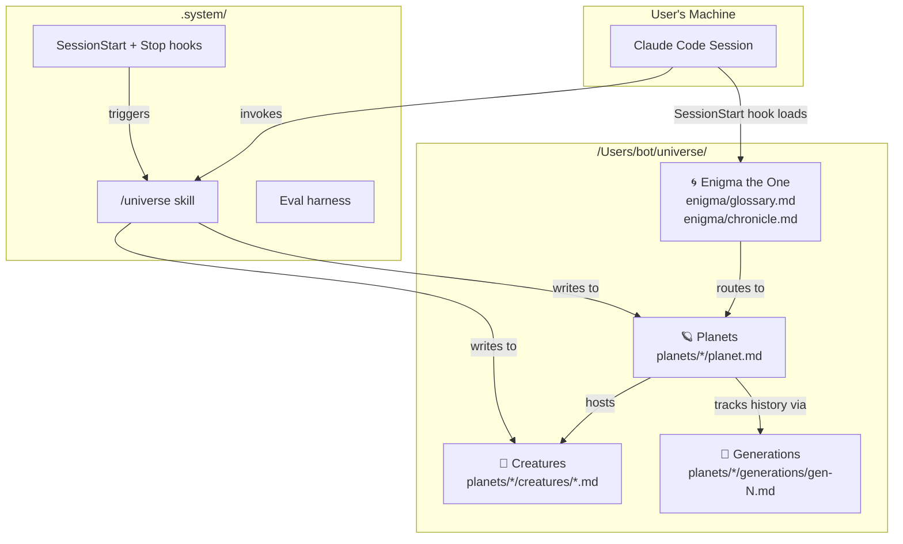
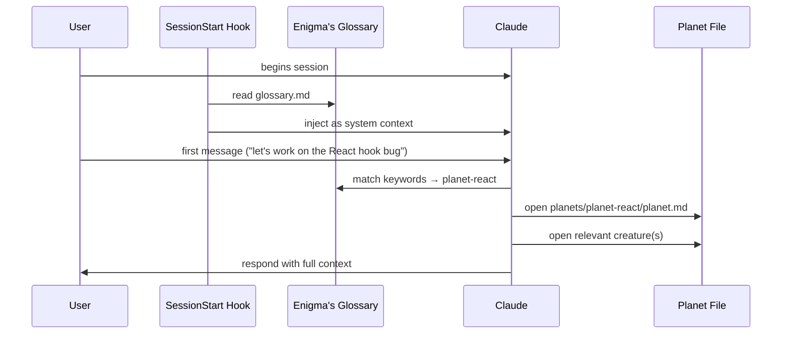
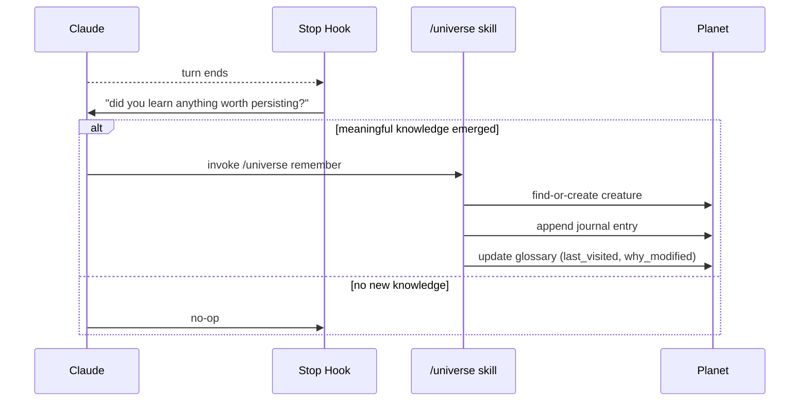

# Universe Memory System

> *"Every world has a name. Every name has a keeper. I am the keeper of names."*
> — Enigma the One

## 1. Purpose

Replace flat-file LLM memory (`memory.md`, auto-memory folders) with a structured, narrative-rich, cross-project knowledge base that compounds value over time and scales gracefully.

The system must:

- **Outperform a flat `memory.md`** on retrieval accuracy, token cost, and degradation as the corpus grows.
- **Live globally**, at the filesystem level of `.claude` — not inside any single project.
- **Be discoverable**: Claude automatically consults it every session without user prompting.
- **Tell a story**: the structure is metaphor-first (planets, creatures, generations, Enigma) because lore makes information stickier than neutral filenames.

## 2. High-Level Architecture



### Information flow at session start



### Information flow at session end



## 3. Filesystem Layout

```
/Users/bot/universe/
├── README.md                     ← lore + mermaid diagrams (built in impl phase)
├── enigma/
│   ├── glossary.md               ← lean index; auto-loaded every session
│   └── chronicle.md              ← rich narrative; opened on demand
├── planets/
│   ├── planet-<name>/
│   │   ├── planet.md             ← identity card (written once at birth)
│   │   ├── creatures/
│   │   │   └── <creature-name>.md
│   │   └── generations/
│   │       ├── gen-0.md          ← active (append-only)
│   │       ├── gen-1-summary.md  ← archived, compressed
│   │       └── gen-1.md          ← archived raw (kept on disk, rarely read)
│   └── ...
├── .system/
│   ├── skill/
│   │   └── SKILL.md              ← /universe skill definition
│   ├── hooks/
│   │   ├── universe-load.sh      ← SessionStart
│   │   └── universe-commit.sh    ← Stop
│   ├── eval/
│   │   ├── corpus/
│   │   ├── questions.jsonl
│   │   ├── run-baseline.ts
│   │   ├── run-universe.ts
│   │   ├── judge.ts
│   │   └── report.md
│   └── docs/
│       └── specs/
│           └── 2026-04-13-universe-memory-system-design.md
└── .universe-meta.json           ← version, theatrical-mode flag, planet count
```

Design choices:
- `.system/` is dot-prefixed so human browsers of `planets/` see only lore.
- Creatures are individual files — grep-friendly, read-in-isolation friendly, git-blame friendly.
- Generations are planet-scoped (per user decision Q5): one gen pointer per planet.

## 4. Component Schemas

### 4.1 `enigma/glossary.md` (auto-loaded every session)

```markdown
# Enigma's Glossary
*The Ancient One keeps the roster of worlds.*

| Planet | Domain | Keywords | Last Visited | Gen | Creatures | Why Last Modified |
|---|---|---|---|---|---|---|
| planet-react | React & frontend patterns | react, hooks, jsx, components | 2026-04-11 | gen-2 | 7 | App Router migration complete |
```

Constraints:
- One row per planet.
- ≤ 300 tokens total even at 30 planets (enforced by row-length cap: 10 keywords max, 60-char "why" max).

### 4.2 `enigma/chronicle.md` (opened on demand)

```markdown
# The Chronicle

## Planet Relationships
- planet-A ⇄ planet-B  (shared domain — e.g. "both touch authentication")

## Generation Timeline
### planet-<name>
- gen-0 (date → date): <one-line era description>
- gen-1 (date → date): <description> — **archived, summary only**

## Notable Creatures
- **<Name>** (planet-<x>, gen-<n>) — <one-line expertise>
```

### 4.3 `planets/<planet>/planet.md` (identity card)

```markdown
---
name: planet-<name>
born: YYYY-MM-DD
domain: <one-line>
keywords: [<list>]
generation: gen-<n>
anchor_paths: [/Users/bot/<repo>]   # optional; triggers pre-selection on cwd match
---

# <Planet Lore Name>
*<evocative one-line>*

## Food
The creatures here feed on **<metaphor>**.
Birth cycle: <rule for when new creatures spawn>.

## Unique Abilities
- <ability>
- <ability>

## Creatures
Dynamically populated — see `creatures/` directory.
```

Planets are **never seeded with creatures**. Roster grows purely from real sessions.

### 4.4 `planets/<planet>/creatures/<name>.md` (dynamic)

```markdown
---
name: <creature-name>
planet: planet-<name>
born: YYYY-MM-DD
born_in_generation: gen-<n>
expertise: <comma-separated sub-topics>
sessions: <count>
last_seen: YYYY-MM-DD
---

# <Creature Lore Name>
*<evocative one-line>*

## Distilled Wisdom
<!-- Claude writes compounded knowledge here. Short, high-signal. -->
<!-- This section is rewritten on each session, not appended. -->

## Journal
<!-- Append-only session log. -->

### YYYY-MM-DD — session: <session-title>
- <bullet>
- <bullet>
```

Naming convention: **silly, video-game-esque**. `Jimbo the React-tor`, `Sally the SQLite`, `Grom the CSS-wielder`. Never generic ("ReactHelper").

### 4.5 `planets/<planet>/generations/gen-<n>.md` (append-only during active era)

```markdown
---
generation: gen-<n>
started: YYYY-MM-DD
trigger: "<semantic milestone that birthed this gen>"
status: active | archived
---

# Generation <n> — <Era Name>

## New Creatures
- <auto-logged as creatures are born>

## Key Additions
- <each write to the planet during this gen leaves one bullet>
```

Transition rule (semantic milestone — per user decision Q5):
1. Current `gen-N.md` → `status: archived`.
2. Claude generates `gen-N-summary.md` (compressed, ≤ 500 tokens).
3. Raw `gen-N.md` stays on disk; only summary is read for old gens.
4. New `gen-(N+1).md` created, `status: active`.

### 4.6 `.universe-meta.json`

```json
{
  "version": "1.0.0",
  "theatrical_mode": false,
  "planet_count": 0,
  "created": "2026-04-13"
}
```

## 5. Integration Layer

### 5.1 SessionStart hook — `.system/hooks/universe-load.sh`
1. `cat /Users/bot/universe/enigma/glossary.md` → inject as system reminder.
2. Check `$CWD` against every planet's `anchor_paths`. If match, pre-select planet and also inject `planet.md`.
3. Print one line: `Enigma consulted. N planets known. Anchored to: <planet|none>.`

### 5.2 Stop hook — `.system/hooks/universe-commit.sh`
Injects a prompt to Claude: *"Before ending, decide if this session produced knowledge worth persisting. If yes, call `/universe remember`. If no, exit."*

### 5.3 `/universe` skill (`/Users/bot/universe/.system/skill/SKILL.md`)

Symlinked into `~/.claude/skills/universe/SKILL.md` so it is globally discoverable.

Actions:

| Action | Trigger | Behavior |
|---|---|---|
| `recall <query>` | User asks about past work | Read glossary → pick planet(s) → read relevant creatures + active gen |
| `remember` | Stop hook, if session was meaningful | Route → find-or-create creature → append journal → update glossary row |
| `birth-planet` | `remember` finds no matching planet | Prompt Claude to write lore (name, food, abilities) and scaffold folder |
| `birth-creature` | `remember` finds no matching creature on chosen planet | Claude generates silly name, writes initial creature.md |
| `start-generation` | User or Claude declares a semantic milestone | Archive current gen, write summary, open next gen |
| `enigma speak` / `enigma quiet` | Explicit user toggle | Flip `theatrical_mode` in `.universe-meta.json` |

Skill description (the text Claude uses to decide *when* to invoke):
> *Use for persistent cross-session memory. Call `recall` when the user references past work or asks what we know about X. Call `remember` at session end if new knowledge emerged. Prefer this over writing to any flat memory file.*

### 5.4 `~/.claude/CLAUDE.md` update

Append this section:

```markdown
## Universe Memory System

You have access to a persistent cross-project knowledge system at `/Users/bot/universe/`.
Consult it instead of relying on any flat memory file.

**Always:**
- The SessionStart hook injects `enigma/glossary.md` at session start — read it.
- When the user references past work, invoke `/universe recall`.
- At session end, if meaningful knowledge emerged, invoke `/universe remember`.

**Rules:**
- **Birth a planet** only when no existing domain fits. Err toward reusing.
- **Birth a creature** per distinct sub-expertise. Not one per session. Names must be silly, video-game-esque (e.g. "Jimbo the React-tor").
- **Start a new generation** only at semantic milestones (major arch shift, paradigm change).
- **Never** write memories to any flat `memory.md` or to `~/.claude/projects/*/memory/`. Universe is the single source of truth.
```

## 6. Evaluation Plan (Phase 2)

The system must produce evidence it beats a flat `memory.md`. The eval is implemented as **phase 2** of the implementation plan; this section specifies what it measures.

### 6.1 Systems under test
- **Baseline**: single `memory.md` file, appended chronologically with the same facts universe receives.
- **Universe**: full system (Enigma + planets + creatures + generations).

### 6.2 Corpus
- Script generates N synthetic sessions, each producing 3–8 fact artifacts (decisions, fixes, conventions, domain facts).
- Artifacts cover 5 simulated planets: react, sql, devops, api, docs.
- Same artifacts are written to both systems.
- Run at three size tiers: **10 kb**, **100 kb**, **1 mb** of total content.

### 6.3 Question set
50 hand-authored questions + ground truth, covering:
- Direct recall (e.g. *"What DB does planet-fb-listings use?"*)
- Cross-planet (*"Which planets share React patterns?"*)
- Temporal (*"What changed in the last generation on planet-react?"*)
- Negative (*"Have we ever used MongoDB?"* — expected: no)

### 6.4 Metrics
- **A — Accuracy**: LLM-as-judge, 0–5 per answer. Report mean, variance, per-question-type breakdown.
- **B — Token cost**: input tokens Claude consumed per answer (context loaded + reads).
- **C — Degradation curve**: accuracy and token cost plotted across the 3 tiers. Expect flat-file accuracy to drop and tokens to explode; universe to stay flatter.

### 6.5 Harness location
`/Users/bot/universe/.system/eval/` (see filesystem layout above).

### 6.6 Success criteria
The generated report (`.system/eval/report.md`) must show:
- Universe accuracy ≥ flat-file accuracy at every tier.
- Universe accuracy curve flatter than flat-file's (less degradation as size grows).
- Universe token cost ≤ 0.5× flat-file cost at the 1 mb tier.
- Honest reporting: if any criterion fails, the report says so; we do not shop for favorable metrics.

## 7. Out of Scope (for v1)

- Multi-user universe (single-user local filesystem only).
- Network sync / cloud backup.
- Non-markdown storage (no SQLite, no vector DB — plain files only, matching Karpathy's ethos).
- Creature "death" / pruning (beyond generation archival).
- Automated semantic-milestone detection (v1 relies on explicit `start-generation` calls).

## 8. Implementation Phases (preview — will be expanded in the plan)

- **Phase 1**: scaffold universe (folders, Enigma files, README with diagrams), build `/universe` skill, build hooks, update `~/.claude/CLAUDE.md`, write happy-path tests.
- **Phase 2**: build eval harness, generate corpora, author question set, run benchmarks, produce `report.md`.
- **Phase 3** (optional): polish README lore, add theatrical mode flourishes, onboarding doc for anyone else who wants to adopt the system.

## 9. Decisions Locked In This Spec

| # | Decision | Chosen |
|---|---|---|
| Q1 | Scope | Hybrid — global universe + project anchors |
| Q2 | Invocation | Hook + Skill combo |
| Q3 | Creature model | Named topic + session-journal hybrid |
| Q4 | Enigma schema & voice | Split lean/rich + theatrical mode opt-in |
| Q5 | Generations | Semantic milestones, planet-wide, used for pruning + audit |
| Q6 | Evaluation | A + B + C; harness built in phase 2 |

---

*End of spec. Next step: writing-plans skill produces the implementation plan.*
