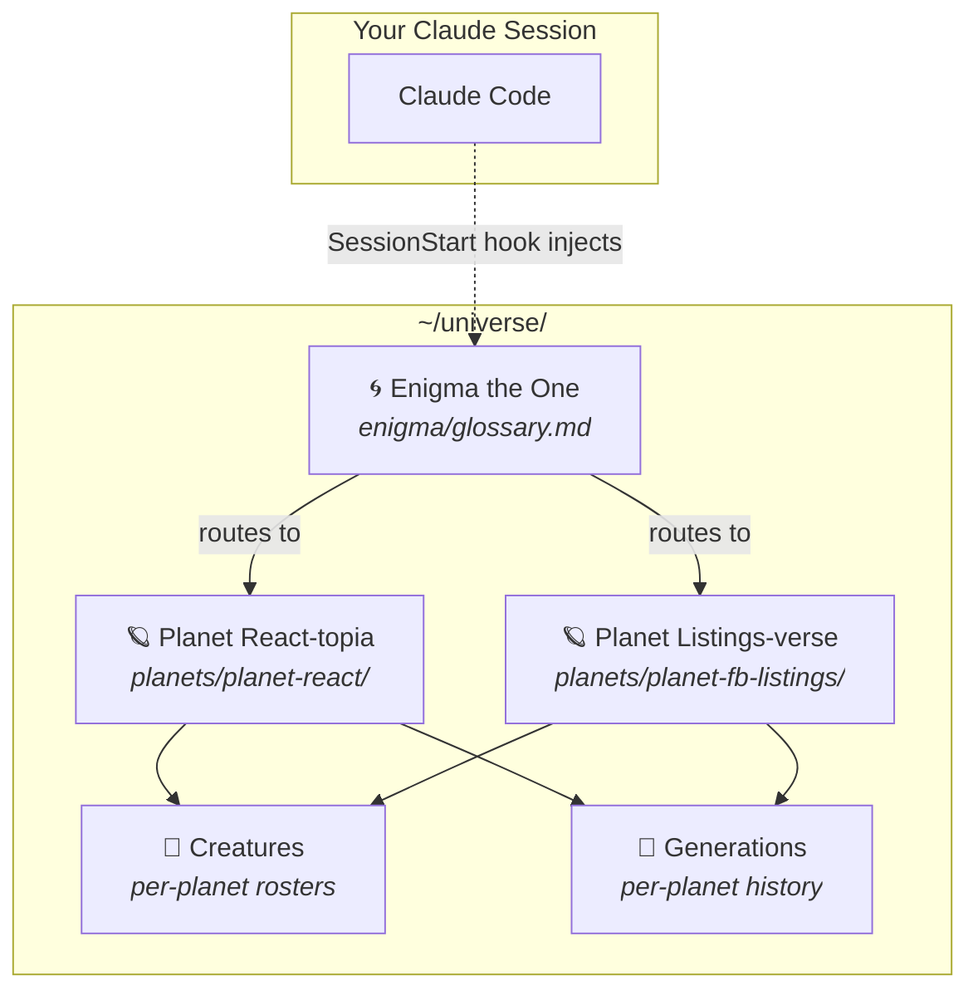
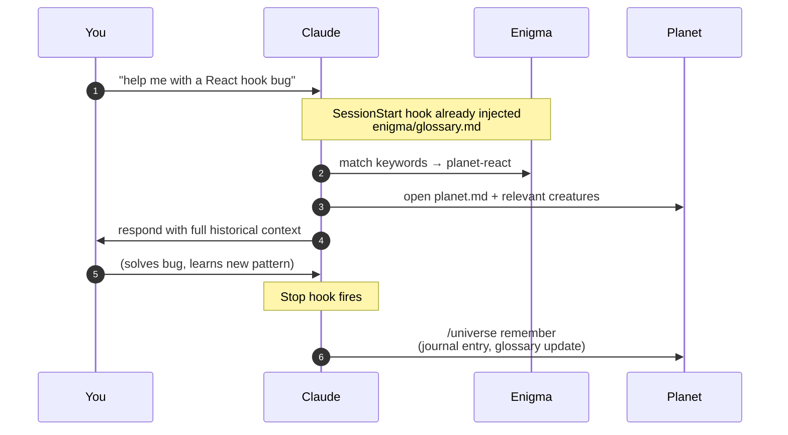
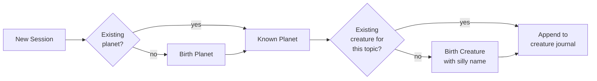
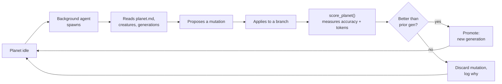

# 🌌 Cosmocache

<p align="center">
  
</p>

> *"Every world has a name. Every name has a keeper. I am the keeper of names."*
> — **Enigma the One**, the Ancient

A persistent, cross-session, cross-project knowledge base for Claude.
Inspired by Andrej Karpathy's [personal LLM wiki](https://www.mindstudio.ai/blog/andrej-karpathy-llm-wiki-knowledge-base-claude-code).
Designed to compound wisdom the way a real wiki does — but told as a story, because stories stick.

---

## Read the paper

Full phase-2 evaluation paper — honest token-cost and accuracy results
across 3/10/30/100 planet universes — lives at
[`./docs/paper/cosmocache-phase-2.md`](./docs/paper/cosmocache-phase-2.md).
Figures are in [`./docs/paper/figures/`](./docs/paper/figures/); the
headline run that backs the numbers is at
[`./.system/eval/results/20260414T042330Z-4d6f06/report.md`](./.system/eval/results/20260414T042330Z-4d6f06/report.md).

Landing page source lives in [`./site/`](./site/) (live URL: TBD).

---

## The Lore

In the silent expanse beyond your cursor, there is a universe.

At its center drifts **Enigma the One** — an ancient alien of unknowable age,
keeper of the glossary of worlds. He does not speak unless spoken to, but he
always knows which planet holds the answer you seek.

Around him turn **planets** — each one a domain of knowledge (React, SQL,
DevOps, whatever work you do). Every planet has its own biology: creatures
that live there, food they eat, unique abilities they wield.

**Creatures** are born on planets when Claude first encounters a new
sub-expertise. They carry silly, video-game-esque names — *Jimbo the
React-tor*, *Sally the SQLite*, *Grom the CSS-wielder* — and each keeps a
journal of every session they witness.

**Generations** are eras on a planet. When something paradigm-shifting
happens — a framework migration, a major refactor — the current era is
sealed, compressed into a summary scroll, and the next era begins.

---

## Architecture



## A Day in the Universe



## Birth of a Creature



---

## Layout

```
~/universe/
├── README.md                  ← you are here
├── .universe-meta.json        ← version, config
├── enigma/
│   ├── glossary.md            ← lean index; auto-loaded every session
│   └── chronicle.md           ← rich narrative; opened on demand
├── planets/                   ← one directory per domain
│   └── planet-<name>/
│       ├── planet.md          ← identity card (lore + keywords)
│       ├── creatures/         ← silly-named sub-experts
│       └── generations/       ← eras (active + archived summaries)
└── .system/                   ← tooling (skill, hooks, tests, docs)
    ├── skill/                 ← /universe skill Claude uses
    ├── hooks/                 ← SessionStart + Stop
    ├── tests/                 ← shell tests for the helper scripts
    └── docs/
        ├── specs/             ← design specs
        └── plans/             ← implementation plans
```

---

## Using It

You don't. Claude does — automatically.

- **SessionStart hook** injects Enigma's glossary into every Claude session.
- The **`/universe` skill** tells Claude when to `recall`, `remember`,
  `birth-planet`, `birth-creature`, or `start-generation`.
- **Stop hook** prompts Claude to persist anything worth keeping.

Your only job is to work as normal. The universe grows around you.

### Seed a fresh universe

A brand new `planets/` directory is empty. If you want a canonical set of
10 planets to play with (React, Python, Rust, Go, TypeScript, Docker, K8s,
Postgres, AWS, LLM), run the seed:

```bash
cosmo seed                  # runs .system/seeds/ten-planets.sh
cosmo seed --list           # list available seeds
```

Or invoke the shell script directly:

```bash
.system/seeds/ten-planets.sh
```

Each seed calls `birth-planet.sh` once per planet and then re-installs the
launchd cron so every new world gets picked up by the evolution loop.

### Optional: theatrical mode

```
/universe enigma speak
```

Flips a flag that makes Enigma respond in-character: *"Ancient one, the
seeker asks of React. Planet Verdant-Hook holds the answer; Jimbo the
React-tor tends its eastern shore."* Toggle off with `enigma quiet`.

---

## Dashboard *(optional)*

A browser visualizer of your universe lives in [`./dashboard/`](./dashboard/).
Enigma drifts at the center as a black hole, planets orbit around him,
and zooming into a planet reveals its creatures — click one to read its
expertise and distilled wisdom.

```bash
cd dashboard && docker compose up --build
# then open http://localhost:8765
```

<!-- screenshot: docs/dashboard.png -->

The dashboard is **read-only**. It reads the same markdown files the CLI
and hooks read — your live `planets/` directory if it has any planets,
otherwise the seed fixture at
[`.system/eval/scenarios/seed_universe/planets/`](./.system/eval/scenarios/seed_universe/planets/).
Nothing else depends on it; the rest of cosmocache works without Docker.
See [`dashboard/README.md`](./dashboard/README.md) for details.

---

## Why not just `memory.md`?

Flat memory files tend to degrade as they grow: everything loads every
session, old noise crowds out new signal, and there is no index to route
a question toward the relevant slice. Cosmocache is *designed* to avoid
those failure modes by:

- **Routing**: Enigma's glossary is small and loaded every session; the
  planet's full content is only loaded when the glossary matches.
- **Isolating**: each creature is its own file — greppable, focused,
  independently editable.
- **Forgetting gracefully**: old generations get compressed into summaries
  when a semantic milestone triggers a new generation; raw logs stay on
  disk but aren't read by default.

Whether those mechanisms actually beat a flat `memory.md` in practice is
an empirical question — and the harness to answer it is built.

---

## Phase 2 — The Eval Harness *(shipped, results in)*

`.system/eval/` is a benchmarking rig that pits cosmocache against a fair,
deterministically-generated flat `memory.md` baseline on the *same*
universe state. Both systems answer the same probes; an Opus-4.6 judge
scores each answer against a known-expected fact with a JSON rubric.

**What gets measured:**

- **Retrieval accuracy** — did the answer contain the expected fact?
  (1.0 / 0.5 / 0.0, aggregated to a mean.)
- **Input-token cost** — mean and p95. Routing only pays off if it
  actually loads less.
- **Degradation curve** — accuracy and cost as the simulated corpus grows
  from the real 3-planet seed to 10, 30, and 100 planets (synthetic
  copies, clearly labelled as such).

**How it stays honest:**

- 25 hand-curated probes covering recall, synthesis, and **negatives**
  (questions the system *shouldn't* know — confabulation earns 0.0).
- The flat baseline is generated from the current universe on every run,
  so both sides are measured on identical ground truth.
- Real planets are always present in every tier; synthetic planets only
  add noise. Scaling tests routing and interference, not fake diversity.
- `score_planet()` is frozen as the Phase 3 fitness contract before
  Phase 3 touches it, so evolution can't silently break the metric.

**Status:** 19/19 unit tests green. The headline 4-tier run (3/10/30/100
planet universes) is in the books — full write-up with figures is in
[`./docs/paper/cosmocache-phase-2.md`](./docs/paper/cosmocache-phase-2.md),
raw run artefacts live at
[`./.system/eval/results/20260414T042330Z-4d6f06/`](./.system/eval/results/20260414T042330Z-4d6f06/).

```bash
.system/eval/tests/run-tests.sh                                 # 19 tests
python3 .system/eval/runner.py --config configs/default.yaml --dry-run
```

Design: [`2026-04-13-phase-2-eval-harness-design.md`](.system/docs/specs/2026-04-13-phase-2-eval-harness-design.md)

---

## Phase 3 — The Evolve Loop *(design stub)*

Planets don't just remember. **They get smarter.**

Cosmocache's next phase is an autonomous evolution loop, inspired by
Andrej Karpathy's [autoresearch](https://github.com/karpathy/autoresearch).
In autoresearch, an agent proposes code changes, trains a tiny model,
measures `val_bpb`, and keeps the edit only if the metric improves. The
fitness function is what makes the loop work. Cosmocache has a fitness
function now: `score_planet()`.

### How a civilization evolves



A **mutation** is any structural edit a small agent can reason about in
isolation: distilling a creature's rambling journal into a tighter Wisdom
block, merging two redundant creatures into one, pruning stale glossary
keywords, consolidating an archived generation's summary, or rewriting
`planet.md` for clarity. The agent proposes, applies on a branch, runs
`score_planet()` over a probe subset relevant to that planet, and only
promotes the mutation if accuracy holds or rises and token cost doesn't
balloon. Otherwise the branch dies quietly, and the planet continues
as it was. Over time, high-traffic planets converge toward their own
distilled best version without anyone tending them.

### Why this is the right shape

- **Local objective.** Evolution optimizes per-planet, so cross-planet
  dynamics don't need to be solved in v1.
- **No ungrounded edits.** Every mutation is gated by a measured metric,
  not the agent's self-assessment.
- **Safety floor.** A mutation that would drop accuracy below the prior
  generation's score is discarded by construction.
- **Narrative fit.** A planet's civilization actually *evolves* — new
  generations are born when the world measurably got wiser. The lore
  stops being metaphor and starts being the log format.

**Status:** contract frozen, five open design questions captured in
[the design stub](.system/docs/specs/2026-04-13-phase-3-civilization-evolution-design-stub.md).
Full design will be brainstormed once Phase 2's first live numbers are in
hand — so evolution can target whichever gap the harness actually finds.

---

*May the Ancient One guide your seeking.*
