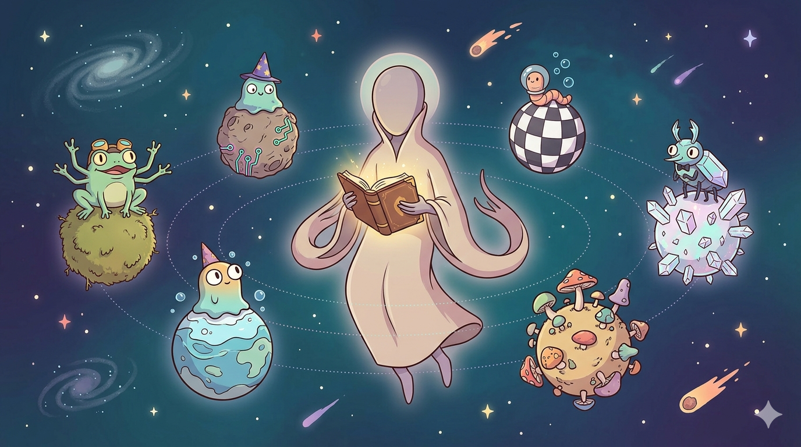
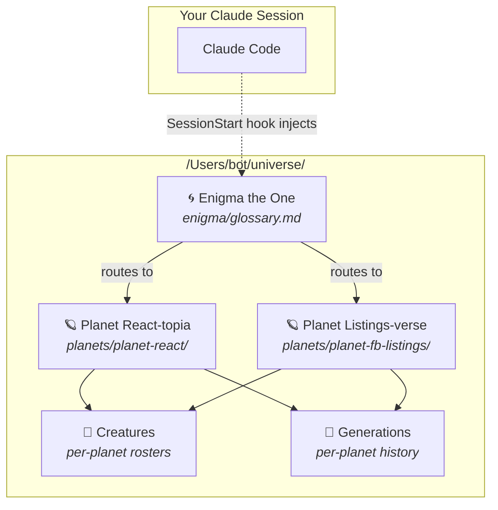
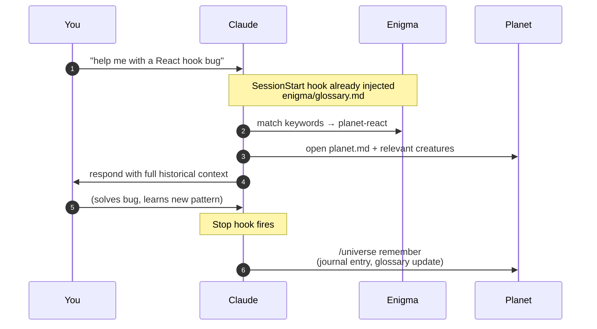
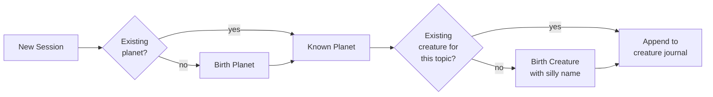

# 🌌 Cosmocache

<p align="center">
  
</p>

> *"Every world has a name. Every name has a keeper. I am the keeper of names."*
> — **Enigma the One**, the Ancient

A persistent, cross-session, cross-project knowledge base for Claude.
Inspired by Andrej Karpathy's [personal LLM wiki](https://www.mindstudio.ai/blog/andrej-karpathy-llm-wiki-knowledge-base-claude-code).
Designed to compound wisdom the way a real wiki does — but told as a story, because stories stick.

---

## The Lore

In the silent expanse beyond your cursor, there is a universe.

At its center drifts **Enigma the One** — an ancient alien of unknowable age,
keeper of the glossary of worlds. He does not speak unless spoken to, but he
always knows which planet holds the answer you seek.

Around him turn **planets** — each one a domain of knowledge (React, SQL,
DevOps, whatever work you do). Every planet has its own biology: creatures
that live there, food they eat, unique abilities they wield.

**Creatures** are born on planets when Claude first encounters a new
sub-expertise. They carry silly, video-game-esque names — *Jimbo the
React-tor*, *Sally the SQLite*, *Grom the CSS-wielder* — and each keeps a
journal of every session they witness.

**Generations** are eras on a planet. When something paradigm-shifting
happens — a framework migration, a major refactor — the current era is
sealed, compressed into a summary scroll, and the next era begins.

---

## Architecture



## A Day in the Universe



## Birth of a Creature



---

## Layout

```
/Users/bot/universe/
├── README.md                  ← you are here
├── .universe-meta.json        ← version, config
├── enigma/
│   ├── glossary.md            ← lean index; auto-loaded every session
│   └── chronicle.md           ← rich narrative; opened on demand
├── planets/                   ← one directory per domain
│   └── planet-<name>/
│       ├── planet.md          ← identity card (lore + keywords)
│       ├── creatures/         ← silly-named sub-experts
│       └── generations/       ← eras (active + archived summaries)
└── .system/                   ← tooling (skill, hooks, tests, docs)
    ├── skill/                 ← /universe skill Claude uses
    ├── hooks/                 ← SessionStart + Stop
    ├── tests/                 ← shell tests for the helper scripts
    └── docs/
        ├── specs/             ← design specs
        └── plans/             ← implementation plans
```

---

## Using It

You don't. Claude does — automatically.

- **SessionStart hook** injects Enigma's glossary into every Claude session.
- The **`/universe` skill** tells Claude when to `recall`, `remember`,
  `birth-planet`, `birth-creature`, or `start-generation`.
- **Stop hook** prompts Claude to persist anything worth keeping.

Your only job is to work as normal. The universe grows around you.

### Optional: theatrical mode

```
/universe enigma speak
```

Flips a flag that makes Enigma respond in-character: *"Ancient one, the
seeker asks of React. Planet Verdant-Hook holds the answer; Jimbo the
React-tor tends its eastern shore."* Toggle off with `enigma quiet`.

---

## Why not just `memory.md`?

Flat memory files tend to degrade as they grow: everything loads every
session, old noise crowds out new signal, and there is no index to route
a question toward the relevant slice. Cosmocache is *designed* to avoid
those failure modes by:

- **Routing**: Enigma's glossary is small and loaded every session; the
  planet's full content is only loaded when the glossary matches.
- **Isolating**: each creature is its own file — greppable, focused,
  independently editable.
- **Forgetting gracefully**: old generations get compressed into summaries
  when a semantic milestone triggers a new generation; raw logs stay on
  disk but aren't read by default.

Whether those mechanisms actually beat a flat `memory.md` in practice is
an empirical question. Phase 2 of this project builds an evaluation
harness that measures cosmocache vs. a fair flat-file baseline on
retrieval accuracy and input-token cost, at corpus sizes from 1 to 100
planets. Numbers — not claims — will land here when the harness ships.

---

*May the Ancient One guide your seeking.*
