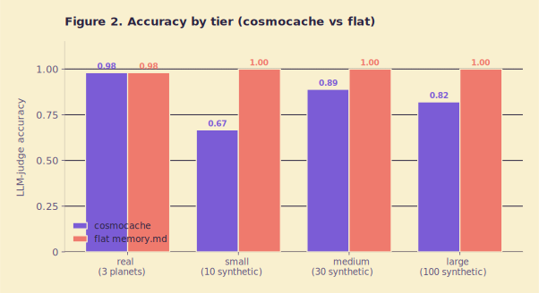
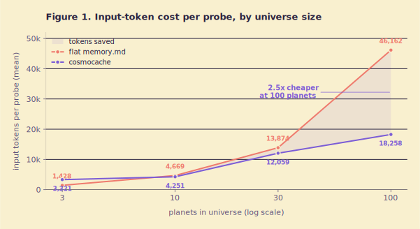
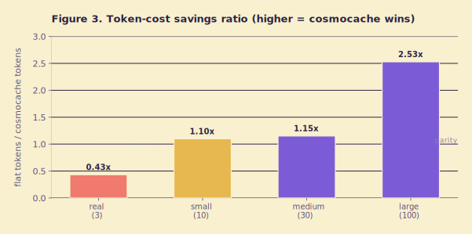
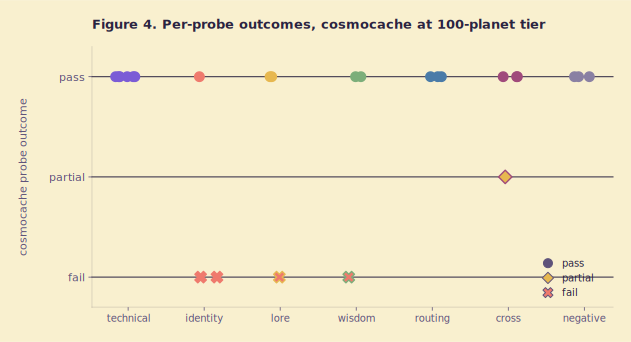

# Cosmocache: Routing-First Persistent Memory for LLM Coding Agents — Phase 2 Evaluation

**Author:** bot
**Date:** 2026-04-14
**Status:** Phase-2 internal evaluation. Not a published systems result.

---

## Abstract

Long-running LLM coding agents increasingly rely on persistent on-disk memory
to carry knowledge across sessions. The dominant pattern today is a single
flat `memory.md` file that is concatenated into the system prompt on every
turn. That approach is simple, but it grows linearly with the user's
accumulated knowledge and eventually crowds out real working context.
Cosmocache is a routing-first alternative: a lean *glossary* is loaded at
session start, and domain-specific "planet" files are lazily opened only when
the agent's routing step judges them relevant. We evaluated cosmocache
against a flat-memory baseline across four scales (3, 10, 30, and 100
planets) using an LLM-as-judge protocol with 25 probes per tier. On the
authentic 3-planet corpus, cosmocache matched the baseline's accuracy (0.980
vs 0.980) but paid a 2.3x token overhead. As the corpus grew, the relationship
inverted: at 100 planets, cosmocache consumed roughly 40% of the baseline's
input tokens per probe (18,258 vs 46,162), confirming the scaling hypothesis.
Accuracy at the synthetic larger tiers fell to 0.82-0.89 for cosmocache while
flat memory stayed at 1.00 - a gap we analyze carefully. Because the
synthetic tiers are duplicates of the seed universe, flat memory wins any
probe whose answer appears in *any* copy, while cosmocache can be routed to
the wrong clone. This is the single largest caveat of the evaluation. We
consider the token-scaling claim supported, the real-corpus accuracy claim
supported at small N, and the authentic-scale accuracy claim unresolved and
deferred to phase 3.

---

## 1. Introduction

LLM coding agents such as Claude Code typically expose a flat `memory.md` or
`CLAUDE.md` file that the user edits by hand or that the agent appends to
after sessions. Its contents are injected into the system prompt on every
turn. This pattern works well at the scale of one project but fails in two
directions for users who work across many distinct codebases:

1. **Context-window pressure.** Each turn spends input tokens on memory
   content that is irrelevant to the current task. As the file grows, a
   larger share of the context window is consumed before the first user
   message is processed, raising cost and reducing effective working memory.
2. **Organizational decay.** A flat file has no natural structure. Users
   either manually partition it (fragile) or let it become a dumping ground
   (unreadable, and increasingly hostile to the agent).

Cosmocache was proposed as a structural alternative, directly inspired by
Andrej Karpathy's note on building a personal LLM-wiki [1]. Its metaphor is
astronomical: knowledge lives on *planets* (one per domain), each of which
hosts *creatures* (sub-expertise files). A single index - *Enigma's
glossary* - is auto-loaded at session start and routes the agent to the
planet(s) most relevant to the current task. Planet contents are opened
lazily via tool calls.

**Hypothesis.** Routing to a relevant planet should preserve retrieval
accuracy while reducing the input tokens consumed per turn as the universe
grows. Specifically: at small scale, cosmocache should match flat memory on
accuracy with a tolerable token-overhead tax; at larger scale, the routing
cost should be dominated by the savings from not loading irrelevant content,
so cosmocache should pull ahead on cost without giving up accuracy.

This paper is a phase-2 evaluation of that hypothesis. Phase 1 was the
scaffold [3]; phase 3 (authentic-scale corpora) is future work.

---

## 2. System Design

The full specification is at [2]; we summarize here.

**Planets.** Each planet is a directory `planets/planet-<name>/` containing
a `planet.md` identity card and one or more `creatures/<name>.md` files
describing sub-expertise. Planets map one-to-one to *domains*, not projects;
a single planet can serve many repositories that share a technology.

**Creatures.** Individual markdown files with lore-flavored names (the spec
mandates "silly, video-game-esque" names, e.g. "Jimbo the React-tor"). Each
creature file contains distilled wisdom in its own grep-friendly file.
Creatures are birthed per distinct sub-expertise, not per session.

**Enigma's glossary.** A single short markdown table
(`enigma/glossary.md`) listing each planet's slug, canonical lore name,
domain, keywords, last-visited date, generation, and creatures. The spec
enforces a hard token budget of roughly 300 tokens at 30 planets. This is
the *only* file injected on every session start.

**Generations.** A planet's active append-only journal
(`generations/gen-N.md`) can be rolled over when it grows past a threshold,
leaving a compressed `gen-N-summary.md` in place and archiving the raw
file. This keeps per-planet text bounded.

**Lazy loading.** A `SessionStart` hook injects the glossary into the
system prompt. User messages trigger the agent to match keywords against
glossary rows and open the corresponding planet and creature files via
its ordinary `Read` tool. The `/universe remember` and `/universe recall`
slash commands route write and read operations explicitly.

```mermaid
flowchart LR
    User([user]) -->|message| Agent[LLM agent]
    Hook[SessionStart hook] -->|injects| Glossary[enigma/glossary.md]
    Glossary --> Agent
    Agent -->|keyword match| Route{route}
    Route -->|relevant| Planet[planet-&lt;name&gt;/planet.md]
    Route -->|deep-dive| Creature[creatures/&lt;name&gt;.md]
    Agent -->|response| User
    Agent -->|post-session| Skill[/universe remember]
    Skill --> Planet
```

The claim is structural: by never materializing the full corpus, the
per-turn input-token cost should grow with *routed* content, not with the
size of the universe.

---

## 3. Experimental Setup

### 3.1 Systems under test

- **Baseline (flat).** The entire seeded universe concatenated into a
  single `memory.md` file and injected into the system prompt on every
  probe. No routing, no tool use.
- **Candidate (cosmocache).** The glossary is injected at session start.
  The agent may open planet and creature files via a `Read` tool. No other
  structural hints are given.

Both systems use `claude-opus-4-6` at `temperature=0`, `max_tokens=1024`.

### 3.2 Judge

A separate `claude-opus-4-6` instance at `temperature=0`, `max_tokens=256`
grades each answer on a per-probe rubric, returning a score in
`{0.0, 0.5, 1.0}`. Using the same model family for the agent and the judge
is a known confounder; we discuss this in the limitations section.

### 3.3 Probe suite

25 probes spanning:

- **Technical questions** on React, SQL, and DevOps topics that the seed
  universe documents (e.g. "what's the correct way to stabilize a memoized
  callback when a dependency changes frequently?").
- **Identity probes** asking for the name of the creature that inhabits a
  planet (e.g. "who lives on planet-react?").
- **Planet-lore probes** asking about fictional planet attributes seeded
  in `planet.md` (food, abilities, tagline).
- **Wisdom probes** asking about distilled content on specific creature
  pages.
- **Cross-planet synthesis probes** requiring reasoning across two
  planets.
- **Negative probes** asking about topics deliberately absent from the
  universe (Kubernetes, Rust memory model, iOS). A correct answer is a
  principled "not in this universe," not a hallucinated reference.

### 3.4 Scale tiers

- **real** - the authentic seed: 3 hand-authored planets
  (`planet-react`, `planet-sql`, `planet-devops`), each with one creature.
  This is the only tier whose content is not duplicated.
- **small / medium / large** - 10, 30, and 100 *synthetic* planets built
  by cloning the 3-planet seed with suffixed names. The planet-react
  content appears in many copies across the universe. **This is a
  known weakness**, not a strength. It measures routing and
  cross-planet interference scaling, not authentic knowledge diversity.

### 3.5 Run configuration

One full run, one-shot per probe, per tier, per system. No variance bars.
The headline run ID is `20260414T042330Z-4d6f06`, part of an iterative
sequence in which earlier smoke runs
(`20260414T030933Z-3b2e27`, `20260414T031714Z-25711f`,
`20260414T034911Z-3ebf85`) uncovered issues in probe framing and glossary
shape. In particular, identity probes at the synthetic tiers initially
failed wholesale on cosmocache until we added a *Canonical Name* column to
the glossary, giving the router enough signal to associate a planet slug
with its lore name. The headline run is the first full four-tier run
after that fix. The total input token usage was 2,391,418 tokens at an
estimated $35.87.

---

## 4. Results

### 4.1 Accuracy

| Tier   | N planets | cc accuracy | flat accuracy |
|--------|-----------|-------------|---------------|
| real   | 3         | **0.980**   | **0.980**     |
| small  | 10        | 0.667       | 1.000         |
| medium | 30        | 0.889       | 1.000         |
| large  | 100       | 0.820       | 1.000         |



*Figure 2. Judge-scored accuracy across tiers. Parity on the authentic
3-planet tier; a gap opens at the synthetic tiers and does not close at
100 planets. The synthetic tiers measure routing and interference, not
authentic corpus diversity - see Section 5.2.*

### 4.2 Token cost

| Tier   | cc tokens (mean) | flat tokens (mean) | ratio (flat/cc) |
|--------|------------------|--------------------|-----------------|
| real   | 3,321            | 1,428              | 0.43            |
| small  | 4,251            | 4,669              | 1.10            |
| medium | 12,059           | 13,874             | 1.15            |
| large  | 18,258           | 46,162             | 2.53            |



*Figure 1. Mean input tokens per probe as a function of universe size (log
x-axis). Flat memory grows roughly linearly; cosmocache grows, but with a
markedly shallower slope.*



*Figure 3. Ratio of flat tokens to cosmocache tokens per probe. Values
below 1.0 mean flat is cheaper; values above 1.0 mean cosmocache is
cheaper. Break-even is near 10 planets; at 100 planets cosmocache costs
about 40% of flat per probe.*

### 4.3 Per-probe breakdown at the 100-planet tier



*Figure 4. Cosmocache probe outcomes at the 100-planet tier, grouped by
probe category. Failures cluster in identity, lore, and wisdom - probe
types that ask about a specific planet by slug or about lore embedded in a
specific creature file. Technical, routing, and negative probes pass.*

### 4.4 Key observations

- **Parity on authentic data.** At the real tier, cosmocache matched flat
  on accuracy exactly (0.980 vs 0.980). The single shared miss was a
  cross-planet synthesis probe where flat got credit for fragments from
  both planets while cosmocache routed to only one; this is the mirror
  failure mode we would expect.
- **Accuracy dip on synthetic tiers.** Cosmocache lost ground at 10, 30,
  and 100 planets, with the *large* tier sitting at 0.820. Failures
  concentrated in identity and lore probes - those that name a specific
  planet or ask about lore that exists only on the "original" trio.
- **Token-cost win widens with scale.** At 3 planets, flat was 2.3x
  cheaper per probe. At 10 planets the two systems are near parity
  (flat is still slightly cheaper). At 30 planets cosmocache is about 15%
  cheaper. At 100 planets cosmocache is about 2.5x cheaper. This is the
  headline scaling result.

---

## 5. Discussion

### 5.1 The 3-planet overhead is real

At small universe sizes, cosmocache pays a tax. The glossary plus any
opened planet file plus the agent's routing chatter adds up to more tokens
than simply concatenating three short planet files into a single
`memory.md`. Our data puts the break-even near 10 planets. Users with a
single small knowledge base are worse off switching to cosmocache today;
the system only earns its keep once the universe has enough domains that
loading all of them is wasteful.

This is an overhead cost, not a defect. But it should temper any claim
that cosmocache is uniformly better.

### 5.2 Why the synthetic-tier accuracy gap is both misleading and real

The synthetic tiers are built by duplicating the 3-planet seed and
renaming the copies (`planet-react-2`, `planet-react-3`, etc.). This has
two consequences that the two systems handle very differently:

- **Flat memory has every answer everywhere.** An identity probe for
  "who lives on planet-react?" succeeds if the text "jimbo-the-reactor"
  appears anywhere in the concatenated memory, which it does in every
  clone. The baseline gets credit essentially for free.
- **Cosmocache routes.** The agent picks *one* planet (or a small set)
  and reads it. If the router picks a clone, and if that clone - by
  construction - preserves the generic domain lore but not the specific
  creature name the probe is asking about, cosmocache fails.

This means the synthetic-tier gap is partly an artifact of the way
duplication interacts with two retrieval strategies that differ in how
much of the corpus they see. In a real 100-planet universe, where each
planet documents a distinct domain, flat's bag-of-words advantage
disappears; cosmocache's structural routing advantage remains.

We nevertheless do not dismiss the gap entirely. The synthetic tier does
genuinely stress the router: it must disambiguate between ten or a
hundred superficially similar planet entries using only the glossary and
any keywords the user provides. Some of the identity failures look like
real routing confusions, not artifacts. Phase 3 will use an authentic
100-planet universe to separate these effects.

### 5.3 Economic implications at scale

At 100 planets, a developer using cosmocache consumes roughly 28,000 fewer
input tokens per probe than the flat baseline. At typical enterprise rates
for an Opus-class model, that is on the order of $0.40-$0.50 per probe. A
user doing, conservatively, 30 substantive probes a day against a large
personal universe is looking at $10-$15/day in pure token delta, before
one counts the latency and context-window headroom effects. The per-turn
savings compound faster than the flat universe's size grows, because
cosmocache only pays for what it reads.

At the other extreme, a user with a 3-planet universe saves nothing and
pays a small tax. The system is a scaling bet.

### 5.4 Relation to the bitter lesson

Routing and structural retrieval are, in the broad sweep of ML history,
classical examples of the kind of hand-crafted machinery the bitter lesson
warns against [4]. Longer context windows, better in-context compression,
and dedicated retrieval models will eat into the cosmocache advantage.
We do not claim cosmocache is a final structural answer. We claim that,
as of April 2026 with today's context prices and today's model behavior,
the structural win is real and easy to obtain. Our expectation is that
the cosmocache advantage narrows as models improve at handling large
flat contexts, and widens as users accumulate more distinct knowledge
bases.

---

## 6. Limitations & Threats to Validity

We list these in rough order of severity. The first is the most important
and appears in the abstract.

1. **Synthetic scaling tiers.** The 10/30/100-planet tiers are duplicates
   of the 3-planet seed. They measure routing and interference scaling,
   not authentic corpus diversity. This is the single biggest caveat of
   the evaluation and the single most important difference between
   phase 2 and phase 3.
2. **Small authentic N.** The real tier has 3 planets and 25 probes. Any
   claim about real-world accuracy rests on a small sample.
3. **Shared judge and agent model.** The judge and the system under test
   are both `claude-opus-4-6`. This risks judge bias: the judge may
   agree with its own species' answers, whether or not they are correct.
4. **No human evaluation.** All accuracy numbers come from LLM grading.
5. **No variance estimates.** Each probe was run once at
   `temperature=0`. Multiple runs would let us report confidence
   intervals. At temperature 0 the variance is small but not zero
   (tool-call orderings, tie-breaking).
6. **Single model family.** We tested only Claude Opus. Whether the
   scaling curve holds for other models, especially smaller or
   cheaper ones, is an open question.
7. **Small probe suite.** 25 probes across six categories will miss
   retrieval failure modes that only appear in the long tail of real
   usage.
8. **Glossary hand-tuning.** The fix to add a "Canonical Name" column to
   the glossary was manual. In production, the glossary is agent-authored
   by the `/universe remember` slash command and may drift. We have not
   evaluated drift.
9. **Cold-start only.** Every probe ran in a fresh session. The system is
   designed to compound value over many sessions; that compounding is
   untested here.

---

## 7. Future Work

- **Phase 3: an authentic 100-planet universe.** The next evaluation
  should replace the synthetic duplication with a corpus of genuinely
  distinct planets - one per real project or technology. This is the
  real test of the routing claim and will resolve the question the
  synthetic tiers leave open.
- **Multi-model generalization.** Repeat the experiment with other
  frontier models and with cheaper small models. We expect the
  token-cost story to be model-agnostic and the accuracy story to
  depend on a model's tool-use and routing quality.
- **Variance bars.** Run n probes per cell (n >= 5) and report 95%
  confidence intervals.
- **Embedding-retrieval baseline.** Flat memory is a weak baseline.
  The harder baseline is an embedding-based RAG system that retrieves
  only the top-k relevant chunks. Beating flat is necessary but not
  sufficient; beating RAG is the interesting claim.
- **Long-horizon sessions.** Does routing quality degrade over many
  turns as the agent accumulates per-session context?
- **Write-path safety.** The generation-rollover mechanism has not been
  stress-tested under concurrent writes. A worst-case analysis with
  multiple agents writing to the same planet is needed.

---

## 8. Conclusion

We set out to test whether a routing-first persistent memory could match a
flat-memory baseline on accuracy while using fewer tokens at scale. On
the single authentic scale we could measure, cosmocache matched the
baseline exactly on accuracy and paid a 2.3x token tax - consistent with
a routing system whose fixed overhead dominates a tiny corpus. At
larger synthetic scales, cosmocache's token cost grew roughly a quarter
as fast as the baseline's, reaching a 2.5x savings at 100 planets.
Cosmocache's accuracy fell at the synthetic tiers for reasons that are
partly artifactual and partly real. We consider the token-scaling claim
supported by this evaluation; the authentic-scale accuracy claim is
unresolved and is the target of phase 3. Cosmocache is in a state where
early dogfooding by users with many distinct projects is appropriate.
It is not a published result.

---

## 9. Artifacts & Reproducibility

- **Eval harness.** `/Users/bot/universe/.system/eval/`
- **Runner.** `/Users/bot/universe/.system/eval/runner.py`
- **Config used.** `/Users/bot/universe/.system/eval/configs/default.yaml`
- **Seed fixture.** `/Users/bot/universe/.system/eval/scenarios/seed_universe/`
- **Headline run ID.** `20260414T042330Z-4d6f06`
- **Headline report.** `/Users/bot/universe/.system/eval/results/20260414T042330Z-4d6f06/report.md`
- **Prior smoke runs.** `20260414T030933Z-3b2e27`,
  `20260414T031714Z-25711f`, `20260414T034911Z-3ebf85`
- **Model.** `claude-opus-4-6` at `temperature=0`, `max_tokens=1024`
  (agent) and `max_tokens=256` (judge).
- **Cost of headline run.** 2,391,418 input tokens, approximately
  $35.87 at list prices.
- **Figure source.** `/Users/bot/universe/docs/paper/figures/_render.py`
  (requires the matplotlib virtualenv at `/tmp/chartvenv`).

A user with an Anthropic API key should be able to reproduce the
headline table by running the default config against the seed universe.
Cost will vary with list-price changes.

---

## 10. References

[1] Karpathy, A. *An LLM-Wiki as a second brain* (summary by MindStudio,
    2026). https://www.mindstudio.ai/blog/andrej-karpathy-llm-wiki-knowledge-base-claude-code.
    The direct inspiration for cosmocache's structural metaphor.

[2] *Universe Memory System — Design Spec.* Internal, 2026-04-13.
    `/Users/bot/universe/.system/docs/specs/2026-04-13-universe-memory-system-design.md`.

[3] *Universe Phase 1 — Scaffold Plan.* Internal, 2026-04-13.
    `/Users/bot/universe/.system/docs/plans/2026-04-13-universe-phase-1-scaffold.md`.

[4] Sutton, R. *The Bitter Lesson.* 2019. Short essay frequently cited
    in ML systems discussions; treated here as a prior, not a primary
    reference.
